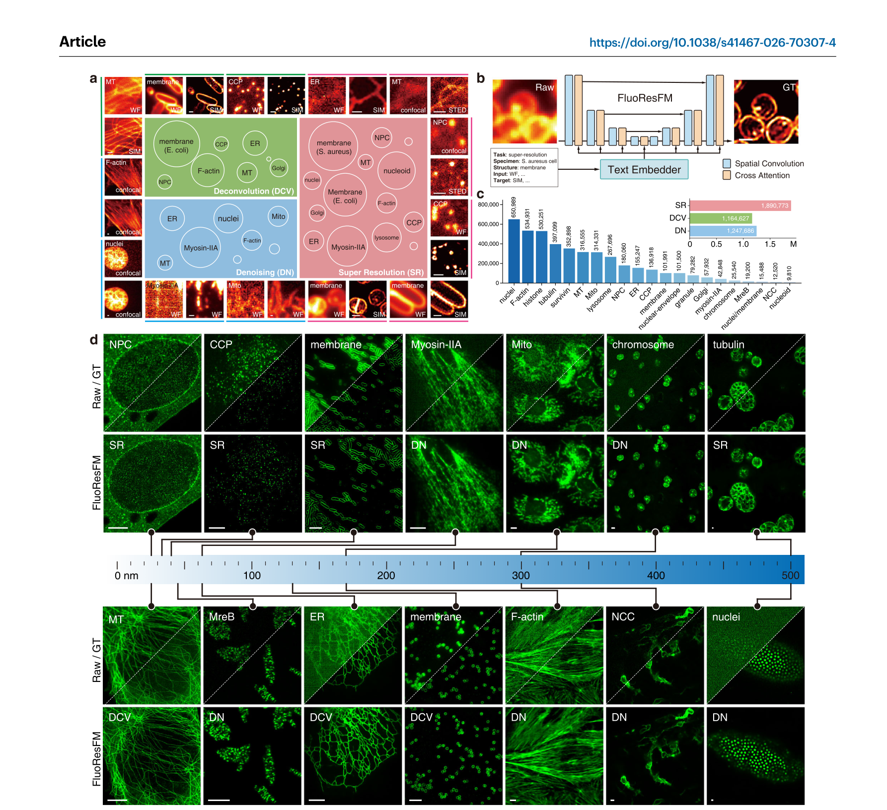
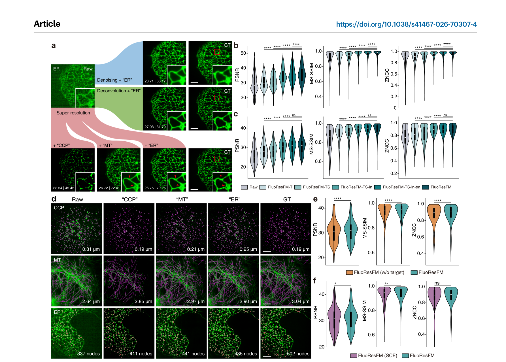

# FluoResFM：荧光显微图像多任务跨分布恢复的基础模型

> **原文**: A foundation model for multi-task cross-distribution restoration of fluorescence microscopy images  
> **期刊**: *Nature Communications* (2026) 17:3729  
> **DOI**: [10.1038/s41467-026-70307-4](https://doi.org/10.1038/s41467-026-70307-4)

---

## 作者信息

陆琦琦 (Qiqi Lu)¹,²,³、刘秀丽 (Xiuli Liu)⁴、冯前进 (Qianjin Feng)¹,²,³、曾绍群 (Shaoqun Zeng)⁴ ✉、程胜华 (Shenghua Cheng)¹,²,³ ✉

1. 南方医科大学生物医学工程学院，广州，中国  
2. 广东省医学图像处理重点实验室，南方医科大学，广州，中国  
3. 广东省医学影像与诊断技术工程实验室，南方医科大学，广州，中国  
4. 华中科技大学武汉光电国家研究中心，生物医学光子学教育部重点实验室，武汉，中国  

---

## 摘要

深度学习在恢复受噪声、模糊或欠采样影响的荧光显微图像方面展现了显著的能力。然而，大多数现有模型都是任务特定的，并且在有限且同质分布的数据上训练，这限制了它们的泛化能力和实用性。在此，我们提出了 **FluoResFM**，一个用于在统一模型中进行荧光显微图像多任务跨分布恢复的基础模型。FluoResFM 利用文本先验信息来适应特定任务和数据分布。该模型在涵盖三个任务（图像去噪、去卷积和超分辨率）和超过 20 种生物结构的数据集上训练，在具有不同生物结构和成像条件的数据集上展现出卓越的恢复性能和增强的泛化能力。通过仅使用单个样本进行微调，FluoResFM 可以在未见数据上进一步改善其性能，取得与传统模型在数百个样本上训练相当的结果，并且可以轻松适应额外任务，包括 3D 图像恢复、表面投影、各向同性重建以及各种倍率的超分辨率。此外，使用 FluoResFM 恢复的高质量图像可以提升现有细胞/细胞器分割模型的性能。

---

## 引言

荧光显微镜是观察生物结构形态和动态的重要工具。然而，由于光照暴露、成像速度和时空分辨率的限制，荧光显微图像常常受到噪声、模糊或欠采样的影响。近年来，基于深度学习的算法在荧光显微图像恢复方面展现出显著前景，包括图像去噪、去卷积和超分辨率，使得对生物结构和动态的观察与分析更加精确。

当前基于深度学习的荧光显微图像恢复方法通常是任务特定的，且在有限、同质分布的数据上训练，这限制了它们在生物研究中的泛化能力和实用性。由于任务目标的显著差异，通常需要为每个恢复任务单独建立模型。此外，研究对象（如网格蛋白包被 pits（CCPs）和微管（MTs））和成像条件（如光照暴露和显微镜类型）在研究环境中差异很大，导致了异质的数据分布。这种分布偏移对深度网络的泛化能力构成了挑战。当一个在特定数据分布上训练的深度网络被应用于具有不同特征的数据时，它可能产生幻觉（hallucinate）细节并生成伪影。此外，由于样品制备和图像采集的复杂性，任务特定的同质数据集往往规模有限且不断增加过拟合的风险。为每个任务和数据集部署单独模型的低效性和不实用性凸显了对一个能够处理多样任务并利用大规模异质数据集的统一模型的需求。

基础模型因其在大规模、多样化数据集上的预训练而展现出卓越的效果和强大的泛化能力，在图像分析和处理领域获得了显著关注。对于图像恢复问题，基础模型可以同时处理多种退化类型，通过有限数据上的微调适应未见任务或数据集，或作为增强下游图像分析任务的有效预处理工具。在荧光显微镜领域，UniFMIR 利用任务特定的网络头部和尾部以及共享的 Swin Transformer 层，在统一框架中处理不同的恢复任务。虽然 UniFMIR 展示了值得称赞的图像恢复精度和跨任务泛化能力，但它没有充分考虑成像对象和条件变化引入的显著数据异质性，可能导致不同数据分布之间的混淆。

在本研究中，我们介绍了 **FluoResFM**，一个用于荧光显微图像多任务跨分布恢复的通用基础模型。FluoResFM 通过去噪、去卷积和超分辨率在统一模型中提升来自不同生物结构和成像条件的图像质量。它利用文本先验信息——包括任务类型、成像对象和成像条件——来引导对特定任务和数据分布的适应。我们在大量真实世界数据集（超过 430 万个配对准图像块用于训练）上训练和评估了 FluoResFM，涵盖三个恢复任务和超过 20 种来自不同成像场景的生物结构类型。全面的评估证明了其在跨不同任务和数据分布的内部和外部未见数据集上的卓越恢复性能和泛化能力。文本先验信息能够有效控制图像内容和模式，为潜在的任务目标和数据分布提供了清晰的指示。作为一个具有强大泛化能力的基础模型，FluoResFM 可以在少至一个样本的微调下，在未见数据上实现改进的恢复性能，获得与传统深度网络在数百个样本上训练相当的结果。FluoResFM 还可以通过单样本微调轻松适应其他任务，包括三维（3D）图像恢复、3D 体积的表面投影、各向同性重建以及各种倍率的超分辨率。此外，当应用于 FluoResFM 恢复的高质量图像时，现有自动分割模型的细胞和细胞器分割性能可以进一步提升。为了使 FluoResFM 可供生物研究社区方便使用，我们开发了一个用户友好的 napari 插件，使其可以轻松集成到成像工作流程中。

---

## 结果

### FluoResFM 的灵感与开发

在同质数据（特定任务、成像对象和成像条件）上训练深度学习模型，使模型能够学习一个强先验，有效约束逆问题的解空间。然而，这种特化在缓解不适定问题固有模糊性的同时，也限制了模型的泛化能力，并在应用于分布外数据时引入了偏差。在荧光显微镜中，在具有特定成像结构类型的数据上训练的模型，由于分布偏移，应用于具有不同模式的结构时经常表现出意外的偏差（补充图 1）。例如，在 CCP 结构数据上训练的 CARE 模型（CARE:CCP），在恢复 MT 图像时会产生错误的 CCP 样结构（补充图 1a）。只有当训练和测试数据共享相同分布时，模型才能生成预期结构（补充图 1a）并取得最佳定量性能（补充图 1b）。尽管在更多异质数据（如 CCP、MT 和内质网（ER）结构的混合）上训练缓解了输出偏差问题（补充图 1a），但它扩大了可行解空间，增加了输出不确定性，并产生了次优结果（补充图 1）。此外，不同任务的不同目标所带来的任务冲突使统一模型中的图像恢复更加复杂。近期研究表明，与任务或图像内容相关的先验信息可以作为不适定逆问题的有力条件，并引导深度学习模型适应不同数据分布，这是提高模型泛化能力的一个有前景的策略。

受此启发，我们设计了 FluoResFM 的架构，以有效融合图像特征与文本先验信息，利用后者引导模型适应来自不同任务和数据分布的荧光显微图像（图 1a）。FluoResFM 基于广泛使用的 U-Net 架构（图 1b）。为了融入文本引导，文本先验信息（包括任务类型、结构类型和成像条件）通过文本编码器编码为特征嵌入。该嵌入随后通过交叉注意力操作在每个尺度的 U-Net 中与空间图像特征融合（补充图 2）。我们采用了 BiomedCLIP 的文本编码器作为文本嵌入器，该编码器已在多种生物医学数据集上预训练，包括通用生物医学插图、放射摄影、数字病理学和显微镜图像。

*图 1：FluoResFM 的整体架构。a FluoResFM 的训练与推理流程。b 文本条件 U-Net 架构。c 训练数据中三个任务的分布。d 用于评估的数据集涵盖了广泛的结构类型和成像条件。*

FluoResFM 在超过 430 万个配对的低质量-高质量图像块上训练（图 1a），涵盖三个任务（去噪、去卷积和超分辨率（×2 上采样））和超过 20 种生物结构类型（图 1c）。为全面评估 FluoResFM 的恢复性能，我们整理了 302 个内部数据集和 51 个外部未见数据集。每个数据集内部是同质的，而整体集合涵盖了三个任务以及广泛的结构类型和成像条件（图 1d）。

### FluoResFM 在内部数据集上的表现

我们将 FluoResFM 与其在无文本先验信息下训练的变体以及 UniFMIR（一个最先进的多任务荧光显微图像恢复基础模型）在内部数据集上进行了比较。在大多数内部数据集上，FluoResFM 获得了更高的平均 PSNR（峰值信噪比）、MS-SSIM（多尺度结构相似性指数）、ZNCC（零归一化互相关）、RSP（分辨率缩放皮尔逊系数）值和更低的 RSE（分辨率缩放误差）值（图 2a、补充图 3a 和补充数据 1）。

*图 2：内部数据集上的性能比较。a 各数据集的定量指标雷达图。b 各任务代表性恢复结果的可视化对比（红色箭头标注关键差异区域）。c 所有内部数据集上各任务的平均定量指标。*

FluoResFM 恢复的图像分辨率与真实图像（GT）的分辨率更加一致（补充图 3b）。总体而言，FluoResFM 在所有三个恢复任务中均展现出优于无文本引导的 FluoResFM 变体和 UniFMIR 的性能（图 2c）。FluoResFM 模型有效抑制了噪声、去除了模糊并增强了图像的空间分辨率，生成的输出更接近高质量的 GT 图像（图 2b）。FluoResFM 能更好地分辨紧密排列的结构（例如，核孔复合体（NPCs）和 MT 的超分辨率图像）（图 2b，红色箭头），并重建出更连续、更清晰的 MT 和 ER 网络（例如，MT 和 ER 的去卷积图像）（图 2b）。相比之下，UniFMIR 会合并相邻物体或产生 MT 和 ER 的碎片化重建（图 2b）。无文本信息引导的 FluoResFM 倾向于对输入图像进行去模糊处理，无法按预期完成去噪任务（例如，CCP 和 F-肌动蛋白丝的去噪）（图 2b），导致去噪任务中某些数据集的 PSNR、MS-SSIM、ZNCC 和 RSP 值明显较低，RSE 值较高（图 2a 和补充图 3a）。这些结果表明，简单地将多个任务统一在一个通用模型中而不加入任务相关的先验信息会导致不可控和不期望的预测。此外，在去卷积和超分辨率任务中，无文本引导的 FluoResFM 不仅在定量上较差（图 2a, c 和补充图 3a），而且与 FluoResFM 相比，其重建结果在视觉上也更模糊（图 2b）。得益于 FluoResFM 卓越的恢复性能，恢复图像中测量的 CCP 直径与 GT 图像更加一致（补充图 4a, d）；MT 网络中的长纤维可以更容易地被追踪（补充图 4b）；在恢复图像中检测到了更完整的骨架和更多的 ER 网络节点（补充图 4c）。因此，与原始输入相比，测量的中位纤维长度（补充图 4e）、平均节点度（补充图 4f）和节点数（补充图 4g）更接近 GT 图像的值。

### FluoResFM 在外部未见数据上的表现

为展示 FluoResFM 在无需模型重新训练或参数调整的情况下的泛化能力，我们在 51 个外部未见数据集上评估了其图像恢复性能。FluoResFM 在大多数数据集上取得了更高的 PSNR、MS-SSIM、ZNCC、RSP 值和更低的 RSE 值（图 3a、补充图 3c 和补充数据 2）。

*图 3：外部未见数据集上的泛化性能比较。a 各外部数据集的定量指标雷达图。b 各任务代表性恢复结果的对比。c 所有外部数据集上各任务的平均定量指标。*

FluoResFM 恢复的图像分辨率与 GT 图像更加一致（补充图 3d）。总体而言，FluoResFM 在所有三个任务中展现出显著优越的定量性能（图 3c）。无文本引导的 FluoResFM 仍然难以处理去噪任务，倾向于重建去模糊图像而非去除噪声（例如，CCP 和 F-肌动蛋白的去噪）（图 3b），这与在内部数据集上的观察结果一致（图 2b）。尽管未在外部数据上训练，FluoResFM 成功恢复了准确的结构细节，与 GT 参考非常接近，例如中空的环状溶酶体，以及球状 CCP、丝状 F-肌动蛋白和 MT（图 3b）。

### 文本先验信息对 FluoResFM 恢复的影响

文本先验信息可以作为引导图像重建过程和控制生成图像内容的有效条件，这在自然图像合成、恢复和增强中已展现出有前景的结果。当与用户指定的恢复任务类型结合时，此类先验知识可以为推断图像内容模式提供有价值的线索，并缓解图像恢复固有的不适定性。在荧光显微镜中，成像对象和条件通常是已知的，这些知识可以作为恢复的先验信息。

FluoResFM 可以通过更改输入的文本提示来有效控制重建的结构模式（图 4a）。

*图 4：文本先验信息对 FluoResFM 恢复的影响。a 不同任务类型和结构类型提示下的恢复结果对比。b 内部数据集上不同文本信息组合的定量比较。c 外部数据集上不同文本信息组合的定量比较。d 不同结构类型提示下的形态学测量精度。e 去除目标元数据的影响。f 与结构化分类嵌入的对比。*

例如，使用"denoising"（去噪）提示时，FluoResFM 仅从 ER 图像中去除噪声，同时保留其固有的模糊和低分辨率（图 4a，蓝色）。"deconvolution"（去卷积）提示对输入图像去模糊（图 4a，绿色），而"super-resolution"（超分辨率）提示进一步上采样图像并恢复更精细的结构细节（图 4a，红色）。只有当使用正确的结构类型提示（如图 4a 中的"ER"）时，FluoResFM 才能产生最准确的恢复。相比之下，当使用"CCP"提示作为输入时，ER 被错误地重建为 CCP 样结构；而"MT"提示则产生了粗细均匀、纵横交错的管状结构，而非正确的厚度不均匀的网状结构（图 4a，红色箭头）。此外，使用正确的结构类型提示时，FluoResFM 相较于原始输入，在形态学测量方面取得了更高的精度，例如 CCP 直径、MT 网络中的纤维长度以及 ER 网络中检测到的节点数和节点度（图 4d 和补充图 5）。相反，错误的结构类型提示可能会降低这些测量的准确性。例如，当使用"MT"或"ER"提示来恢复 CCP 图像时，CCP 直径被高估（补充图 5a）。使用不匹配的"CCP"提示导致 MT 和 ER 图像中严重的重建失真（图 4d），导致 MT 网络中提取的纤维平均长度缩短（补充图 5b），以及 ER 网络中检测到的节点数减少（补充图 5c）。由于 MT 和 ER 之间的结构相似性，"MT"和"ER"提示之间的混淆并未导致纤维长度或节点数/节点度测量的显著下降（补充图 5b-d），尽管详细的结构特征被扭曲（图 4a）。这些结果凸显了文本先验在引导图像恢复过程中的强可控性。鉴于结构类型提示在恢复中的关键作用，我们采用了一个基于图像检索的分类器来帮助普通用户识别输入图像的结构类型，从而防止图像-提示不匹配（补充注释 1 和补充图 7）。

此外，先验信息的缺乏降低了 FluoResFM 的性能（图 4b, c）。与仅使用任务信息（FluoResFM-T）、仅使用任务和结构信息（FluoResFM-TS）、或仅使用任务、结构和输入元数据（即采集输入图像所使用的显微镜类型和参数）（FluoResFM-TS-in）作为输入的 FluoResFM 相比，使用完整文本先验信息的 FluoResFM 在内部（图 4b）和外部未见数据集（图 4c）上都取得了显著更高的 PSNR、MS-SSIM 和 ZNCC 值。恢复质量随着文本信息的增加而提高（图 4b, c）。当详细的目标成像参数不可用时，仅使用任务、结构、输入元数据和目标显微镜类型信息（FluoResFM-TS-in-tm）的 FluoResFM 仍然取得了可接受的恢复结果，在内部数据集上表现较好（图 4b），在外部数据集上 PSNR 和 ZNCC 无显著差异（图 4c）。在训练和推理阶段都去除目标元数据会导致内部（补充图 6a）和外部数据集（图 4e）上大多数指标的适度下降。与使用结构化分类嵌入（方法部分）相比，FluoResFM 在内部数据集上的性能略有下降（补充图 6b），但在外部数据集上展现出更好的泛化能力（图 4f）。

### 通过微调将 FluoResFM 迁移到未见数据

训练数据的可用性是影响深度学习模型性能的关键因素。训练数据不足常常导致恢复性能不理想。迁移学习通过利用从大规模数据集学习到的先验知识并将其迁移到有限、任务特定、同质的未见数据（这些数据本身不足以独立训练）提供了一种解决方案。为评估 FluoResFM 将知识迁移到未见数据的效率，我们分别在 12 个具有不同生物结构的外部数据集上对模型进行了微调。对于每个数据集，仅使用单张图像进行微调。为进行比较，使用相同样本从头训练了传统的基于深度学习的图像恢复模型（CARE 网络和深度傅里叶通道注意力网络（DFCAN））。CARE 产生了最低的 PSNR、MS-SSIM 和 ZNCC 值，甚至低于低质量输入图像（图 5a）。

*图 5：单样本微调 FluoResFM。a 不同方法在 12 个外部数据集上的定量比较。b 活细胞动态成像中微调 FluoResFM 的恢复结果（红色虚线框标注关键区域）。c 不同模型在训练过程中的 PSNR 曲线（过拟合对比）。d 不同训练数据规模下 CARE 和 DFCAN 与单样本微调 FluoResFM 的性能对比。*

虽然 DFCAN 取得了比 CARE 更好的结果，但其性能仍远低于 FluoResFM（图 5a）。它们的糟糕表现主要归因于过拟合，这是由训练数据不足导致的（图 5c）。虽然 CARE 和 DFCAN 的过拟合问题可以通过更多训练数据来缓解，但它们需要数百张图像才能达到 FluoResFM 仅用单张图像微调的性能（图 5d）。相比之下，UniFMIR 和 FluoResFM 都展现出更强的抗过拟合能力（图 5c），并且在微调后获得了更好的性能（图 5a）。微调后的 FluoResFM 模型取得了显著高于从头训练的 CARE 和 DFCAN、未微调的 UniFMIR 和 FluoResFM、以及微调的 UniFMIR 模型的 PSNR、MS-SSIM 和 ZNCC 值（图 5a）。为测试其在动态成像中的适用性，我们分别在 CCP 和溶酶体的活细胞成像的 0 秒图像上微调了 FluoResFM（图 5b）。微调后的模型被应用于恢复后续时间点的图像。FluoResFM 显著提高了原始图像的 SNR 和分辨率，使得微小结构能被更清晰地区分，其动态能被更准确地追踪（图 5b，红色虚线框）。得益于此，在恢复图像中测量的 CCP 直径（补充图 8a, c）和溶酶体数量（补充图 8b, d）在所有时间点上与 GT 图像测量值更加一致，并减少了帧间的虚假波动（补充图 8c）。

FluoResFM 还可以通过微调进一步适应其他恢复任务，例如 3D 图像恢复、表面投影、各向同性重建和更高上采样倍率的超分辨率。对于 3D 图像恢复，低质量的 3D 体积输入可以逐切片使用 FluoResFM 恢复，也可以作为多通道 2D 输入处理，使得所有切片可以同时通过 FluoResFM 恢复（图 6a）。

*图 6：通过单样本微调将 FluoResFM 迁移到其他恢复任务。a 3D 图像恢复的两种策略示意图。b 表面投影的两种策略示意图。c 3D 图像恢复结果对比（白色箭头标注轴向连续性差异）。d 表面投影结果对比（白色箭头标注细节保留差异）。e,f 各向同性重建结果。g 各向同性重建前后的傅里叶频谱分析。h-j 3×、4× 和 8× 超分辨率结果。*

对于 3D 体积的表面投影，为获得高 SNR 的 2D 表面图像，低 SNR 的 3D 体积输入可以先通过最大强度投影投影为低 SNR 的 2D 表面图像，然后使用 FluoResFM 去噪。或者，3D 体积也可以作为多通道 2D 输入处理，通过 FluoResFM 直接投影为 2D 表面图像（图 6b）。对于每个任务，仅使用单个样本进行微调。

对于 3D 图像恢复任务，与逐切片恢复（FluoResFM-S2S）相比，具有多通道输入和输出的 FluoResFM（FluoResFM-M2M）可以利用相邻切片的信息并在轴向上产生更连续的结构（图 6c，白色箭头）。定量上，FluoResFM-M2M 取得了比 FluoResFM-S2S 更高的 PSNR、MS-SSIM 和 ZNCC 值（补充图 9a）。对于表面投影任务，与对最大投影图像去噪（FluoResFM (dn)）相比，通过 FluoResFM 将低 SNR 3D 体积直接投影为 2D 表面图像（FluoResFM (proj)）保留了更多详细结构（图 6d，白色箭头），并获得了更高的 PSNR、MS-SSIM 和 ZNCC 值（补充图 9b）。在各向同性重建任务中，FluoResFM 有效改善了图像的轴向（z 轴）分辨率，使相邻细胞核能被更好地区分（图 6e, f）。恢复前后图像的傅里叶频谱分析表明，轴向维度的频率得到了良好恢复，并且由轴向采样不足引起的频域混叠伪影减少了（图 6g）。对于倍率为 3×、4× 和 8× 的超分辨率任务，FluoResFM 有效提升了输入图像的质量，生成的输出接近高质量参考图像（图 6h-j）。定量上，与低质量输入相比，恢复图像取得了显著更高的 PSNR、MS-SSIM 和 ZNCC 值（补充图 9c-e）。

### 提升自动细胞和细胞器分割性能

细胞体、细胞膜、细胞核和其他细胞器的精确分割对于许多细胞生物学应用至关重要。现有的自动细胞和细胞器分割方法，如 Cellpose-SAM 和 Nellie，在多种细胞和细胞内结构上展现出令人印象深刻的通用性，但它们对图像退化的鲁棒性有限。当应用于 FluoResFM 恢复的图像时，它们的分割性能可以得到显著提升。我们使用了 72 个包含各种细胞和细胞器结构的数据集来评估 FluoResFM 在细胞和细胞器分割中的有效性。低质量图像首先使用 FluoResFM 恢复，然后使用 Cellpose-SAM 或 Nellie 进行分割以获得目标掩膜（图 7a）。

*图 7：提升现有细胞和细胞器分割模型的性能。a FluoResFM 作为分割预处理工具的流程示意图。b 在退化图像和 FluoResFM 恢复图像上使用 Cellpose-SAM/Nellie 的分割结果对比。c 各数据集上分割精度的定量比较（AP 和 IoU）。*

具体而言，Cellpose-SAM 用于细胞核和细胞膜分割，而 Nellie 用于细胞内细胞器分割。从高质量 GT 图像中导出的分割掩膜作为参考。

直接在退化图像上应用 Cellpose-SAM 或 Nellie 常常导致不准确的分割，产生缺失（CCP 和细胞核，图 7b）、粘连（溶酶体和细胞核，图 7b）、碎片化（线粒体（Mito）、ER 和 MT，图 7b）的细胞器或细胞核掩膜。相比之下，在 FluoResFM 恢复的图像上进行分割要明显更准确（图 7b）。定量上，在大多数评估的数据集上，平均精度（AP）和交并比（IoU）值都有所提高（图 7c），凸显了 FluoResFM 在多样生物结构和成像条件下的鲁棒性和有效性。

---

## 讨论

大多数现有的基于深度学习的荧光显微图像恢复模型是在具有特定任务、成像对象和成像条件的数据上训练的（图 1a）。实际应用中的数据分布偏差可能导致它们的性能下降并增加产生幻觉的风险（补充图 1）。预训练的基础模型 UniFMIR 利用任务特定的网络头部和尾部在统一模型中执行不同任务。然而，它没有充分考虑不同成像对象和条件下图像内容模式的变化，这可能导致其对不同结构的混淆（图 2b, 3b）。为解决这一局限性，我们提出的 FluoResFM 模型利用文本先验信息引导模型适应不同任务和数据分布。在广泛多样的内部和外部未见数据集上的验证（图 2, 3 和补充图 3）表明了其在荧光显微图像恢复方面的优越性能。文本提示可以有效控制恢复图像中的结构模式（图 4a），并作为关于潜在数据分布的信息性先验，从而增强模型在多样成像场景中的泛化能力。

在多样化数据分布上的预训练使 FluoResFM 能够提取通用表示并在未见数据上实现更好的泛化。当仅使用单样本微调一小部分模型参数时，FluoResFM 没有出现过拟合，并产生了与传统深度网络在多数百倍数据上训练相当的准确恢复结果（图 5）。此外，它可以通过微调轻松适应其他未见任务，如 3D 图像恢复、表面投影、各向同性重建和各种倍率的超分辨率（图 6）。这减轻了基于深度学习的模型部署对大型训练数据集的严重依赖。此外，FluoResFM 可以作为即插即用的工具来增强后续分析任务，如细胞和细胞内结构分割（图 7）。FluoResFM 的多功能性和泛化能力凸显了其在生物学研究中的实用价值。为使 FluoResFM 更易于生物研究社区使用，我们开发了一个用户友好的 napari 插件，支持交互式数据预处理、模型训练、微调和预测（补充图 10 和补充视频 1）。

尽管有这些优势，但在未来的工作中仍需考虑几个局限性以提升 FluoResFM 的性能和适用性。**首先**，虽然 FluoResFM 可以通过微调迁移到训练期间未见过的恢复任务，但将专门针对这些任务的额外数据集纳入训练语料库可以进一步提升其性能。然而，目前此类数据集的数量仍然相对有限。**其次**，虽然 FluoResFM 已被调整为执行 3D 图像恢复和表面投影，但将其扩展为全 3D 网络可能对建模体积信息更有效。然而，目前缺乏可访问的大规模 3D 训练数据集阻碍了其发展。**第三**，FluoResFM 在多样的荧光显微镜数据上训练并展现了有前景的结果，但考虑到成像对象和显微镜技术的多样性，所覆盖的场景仍然有限。我们计划持续收集更多数据并训练模型以进一步提升其泛化能力。此外，使用自然图像处理领域涌现的更先进的网络架构可能进一步增强 FluoResFM 的性能，这些架构提供了改进的图像和文本信息融合能力。目前，FluoResFM 需要相对较大的内存占用和较长的计算时间，特别是对于高分辨率图像（补充表 8）。然而，其推理时间并不随参数量按比例增长，且与 UniFMIR 相当。架构设计的改进，如 SwinIR 和 Restormer，可能提升其效率，值得进一步探索。

---

## 方法

### 数据收集与预处理

我们收集了大量公开可获取的荧光显微图像数据集，涵盖去噪、去卷积和超分辨率任务中多样的成像对象和条件，用于模型训练和评估（补充表 1-4 和补充数据 3）。作者未进行任何细胞培养实验。每个数据集的成像对象和条件信息均人工整理。低质量输入图像和高质量 GT 图像均使用基于百分位数的归一化方法归一化到共同的强度范围，以第 3 百分位数为最小值，第 99.5 百分位数为最大值。对于超分辨率任务，低质量图像使用最近邻插值上采样以匹配高质量 GT 图像的尺寸。对于内部数据集（补充表 1 和补充数据 3），我们手动将缺乏预定义划分的数据集按约 80:20 的比例分为训练集和测试集。为实现跨不同数据集的同步训练，我们将训练图像裁剪为相同空间尺寸（64×64 像素）的图像块（图 1a）。仅包含噪声的图像块被排除在训练集之外。最终的训练数据相对均匀地分布在三个任务中，考虑到超分辨率问题的复杂性，该任务分配了更多数据（图 1c）。训练数据涵盖超过 20 种结构类型，包括 CCP、ER、F-肌动蛋白、MT、肌球蛋白-IIA、细胞核、组蛋白、核膜、细胞膜、颗粒、微管蛋白、类核、溶酶体、存活素、神经嵴细胞（NCC）、核孔复合体（NPC）、MreB、线粒体（Mito）、染色体和高尔基体，使用宽场显微镜、结构照明显微镜、即时结构照明显微镜、共聚焦显微镜、多光子显微镜、光片显微镜、双光子显微镜和受激发射损耗显微镜进行成像。文本先验信息包括任务类型、样本类型、结构类型、荧光指示剂，以及采集低质量输入图像和高质量 GT 图像所使用的显微镜技术及其参数设置，按顺序拼接为单一文本输入（补充表 7）。用于恢复性能评估的内部和外部数据集详细信息，以及用于分割评估的数据集信息见补充数据 4。用于 3D 图像恢复、表面投影、各向同性重建和 3×、4×、8× 上采样倍率超分辨率任务的数据集信息见补充表 3。

### 网络架构与训练损失

FluoResFM 的骨干网络实现为文本条件 U-Net（图 1b、补充图 2 和补充表 6），包含编码器、解码器和跳跃连接。编码器以卷积层开始，解码器以卷积层结束以生成恢复图像。编码器和解码器的每个尺度包含一个残差块和一个文本-图像融合块（补充图 2）。文本-图像融合块利用交叉注意力机制将文本先验信息与图像特征整合。文本先验信息首先通过 BiomedCLIP 中的预训练文本编码器投影为文本嵌入 z ∈ ℝ^(l×d)（其中 l 为上下文长度，设为 160，d 为嵌入向量大小），然后注入文本-图像融合块中的交叉注意力层。对于 FluoResFM (SCE) 模型，我们将非结构化的文本先验嵌入替换为任务、结构和显微镜类型的结构化分类嵌入。具体而言，为每个任务类型、结构类型和显微镜类型分配唯一 ID，并将其映射为可学习的嵌入。结构化分类嵌入可以表示为：

**z_sce = embed(x_task, x_structure, x_micro_in, x_micro_target) ∈ ℝ^(4×d)**

其中 d 为嵌入向量大小，embed(·) 表示存储每个任务类型、结构类型和显微镜类型的可学习嵌入的查找表，x_task、x_structure、x_micro_in 和 x_micro_target 分别是对应于任务类型、结构类型以及输入和目标显微镜类型的 ID。

我们使用平均绝对误差损失 L1 来计算恢复图像与相应高质量 GT 图像之间的误差：

**L1 = (1/N) × Σ|Ie(i) − Igt(i)|**

其中 N 是图像 I 中的总像素数，i 是像素索引，Ie 是恢复图像，Igt 是高质量 GT 图像。

### 评价指标

我们采用五项图像质量评估指标（PSNR、MS-SSIM、ZNCC、RSE 和 RSP）来定量评估不同方法的图像恢复性能。PSNR 用于衡量恢复图像与 GT 图像之间的逐像素差异，使用 scikit-image 包（版本 0.22.0）实现。MS-SSIM 用于量化恢复图像与 GT 图像在多个空间尺度上的结构相似性，使用 pytorch-MS-SSIM 包（版本 1.0.0）实现。与单尺度 SSIM 不同，MS-SSIM 将不同尺度的结构纳入评估。ZNCC 用于评估恢复图像与 GT 图像之间的互相关性，定义为：

**ZNCC = (1/N) × Σ((Ie − μe)/σe) × ((Igt − μgt)/σgt)**

其中 N 是总像素数，i 是像素索引，Ie 是恢复图像，Igt 是高质量 GT 图像。μe 和 μgt 分别是 Ie 和 Igt 中的平均像素强度。σe 和 σgt 分别是 Ie 和 Igt 中像素强度的标准差。

SQUIRREL 分析用于计算 RSE 和 RSP 指标，该分析使用 Python 的 NanoPyx 框架实现。RSE 测量参考图像与分辨率缩放图像之间的均方根误差，RSP 计算参考图像与分辨率缩放图像之间的皮尔逊相关系数。使用去相关分析估计图像分辨率，该方法在不同结构和成像模态下已证明具有一致的鲁棒性。

在计算这些指标之前，我们对每张恢复图像及其对应的 GT 图像进行基于百分位数的归一化，以匹配二者之间的动态范围：

**Norm(I, p_low, p_high) = (I − percentile(I, p_low)) / (percentile(I, p_high) − percentile(I, p_low))**

其中 I 是恢复图像或 GT 图像，percentile(I, p) 计算图像 I 中像素值的第 p 个百分位数，p_low 和 p_high 分别设置为 0.03 和 0.995。

我们使用预测掩膜与真实掩膜之间的 IoU 和 AP 来量化分割性能。AP 定义为：

**AP = TP / (TP + FP + FN)**

其中 TP（真阳性）是 IoU 高于阈值 0.5 的匹配数，FP（假阳性）是无匹配的预测掩膜数，FN（假阴性）是遗漏的真实掩膜数。以上所有指标均使用 Python 实现。此外，我们使用自研 MATLAB (R2023b) 代码测量 CCP 直径，使用开源软件包 SIFNE 量化 MT 网络中的纤维长度，使用 Nellie（版本 0.4.1）检测 ER 网络中的节点。

### 图像可视化

子图使用 Python 生成，并使用 Adobe Illustrator 拼合为合成图。对于图 1a 和 b 中的图像块，我们使用"hot"颜色映射来显示信号强度。在可视化之前，图 1d、图 2-6、补充图 4 和补充图 1 中的图像经过归一化后转换为 RGB 格式。对于图 2a、图 3a 和补充图 3a, c 的雷达图，每个数据集的指标值根据最小值和最大值单独归一化：

**M_norm = (M − M_l) / (M_h − M_l)**

其中 M 是不同方法的指标值向量，M_l 和 M_h 分别是下限和上限。这些限值自动确定，使得最小和最大数据点分别对应轴范围的 20% 和 95% 位置。图 7a 和 b 中的图像使用"gray"颜色映射绘制。

### 适应 FluoResFM 处理 3D 数据

对于 3D 图像恢复任务，为实现多通道输入和输出，FluoResFM 头部卷积层的输入通道数和尾部卷积层的输出通道数被设置为与输入体积的切片数相同。对于表面投影任务，仅调整网络头部卷积层的输入通道数以匹配输入体积的切片数。

### 网络训练与微调

FluoResFM 模型使用 PyTorch 深度学习框架（PyTorch 2.6.0）实现，并由 AdamW 优化器优化。批量大小设为 16，模型训练 700,000 次迭代。初始学习率设为 1×10⁻⁵，每 100,000 次迭代减半。为保持不同网络之间训练条件的一致性和进行公平比较，对比方法遵循类似的训练设置（补充表 5）。在微调期间，仅更新 U-Net 骨干的第一层和最后一层卷积层的参数，所有其他参数被冻结（补充图 2）。训练设置保持不变，但总迭代次数除外（补充表 5）。所有实验在一台配备 Intel Core i9-14900K 处理器和 NVIDIA GeForce RTX 4090D 图形处理卡（24GB 内存）的计算机上进行。

### 统计学与可重复性

每组超参数的神经网络均训练一次。随机种子在网络参数初始化时固定。每个数据集的训练和测试图像随机划分。每个数据集内的图像来自不同样本，在相同成像条件下采集。对于两组之间的比较，使用单侧 Wilcoxon 符号秩检验。p 值 < 0.05 被认为具有统计学显著性。所有统计分析使用 Python（版本 3.11.9）和 SciPy 包（版本 1.12.0）进行。未使用统计方法预先确定样本量。没有数据被排除在分析之外。

---

## 数据可用性

本研究使用的所有数据集均来自现有文献，并通过补充表 1-4 中提供的相应链接公开获取。用于训练和测试的示例数据可在 Zenodo 仓库获取（https://doi.org/10.5281/zenodo.18382702）。其他原始数据（如图像原始数据和深度学习中间数据）因文件体积较大，可根据通讯作者要求提供。源数据随本文提供。

---

## 代码可用性

源代码可通过 GitHub 仓库（https://github.com/qiqi-lu/fluoresfm）和 Zenodo 仓库（https://doi.org/10.5281/zenodo.18383925）获取。napari 插件代码可通过 GitHub 公开获取（https://github.com/qiqi-lu/napari-fluoresfm）。napari 插件使用指南视频可在 Bilibili 观看（https://www.bilibili.com/video/BV16JeFzuEof）。来自 BiomedCLIP 的预训练文本和图像编码器以及预训练的 FluoResFM 模型可在 Zenodo 仓库公开获取（https://doi.org/10.5281/zenodo.18382702）。

---

## 参考文献

（共 64 篇参考文献，详见原文）

---

## 致谢

本研究获得国家自然科学基金（项目号 62471212 和 62201221 给 S.C.）、广东省基础与应用基础研究基金（2025A1515011333 给 S.C.）以及广州市科技计划项目（2024A04J4960 给 S.C.）的资助。我们感谢华中科技大学袁菁教授的宝贵建议。

---

## 作者贡献

S.C. 和 S.Z. 监督本研究。S.C.、Q.L. 和 Q.F. 构思并启动了该项目。Q.L. 和 S.C. 开发并实现了算法。Q.L.、S.C. 和 X.L. 设计并执行了验证实验。Q.L. 开发了 napari 插件。Q.L. 和 S.C. 在 S.C.、Q.F. 和 X.L. 的指导下撰写了手稿。所有作者讨论了结果并修改了手稿。

---

## 利益冲突

作者声明 no competing interests。

---

## 补充信息

在线版本包含补充材料，可通过 https://doi.org/10.1038/s41467-026-70307-4 获取。

---

*翻译日期：2026-07-26*
*本文档为 Nature Communications 论文 "A foundation model for multi-task cross-distribution restoration of fluorescence microscopy images" 的中文完整翻译，仅供学习和研究参考。*
