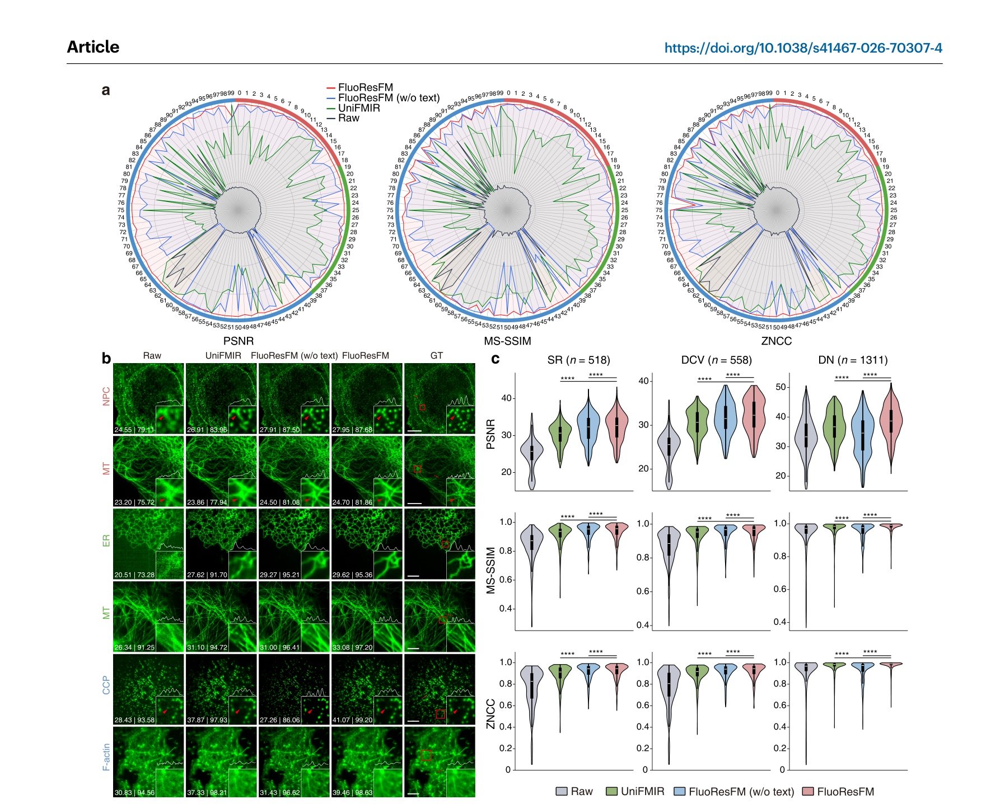
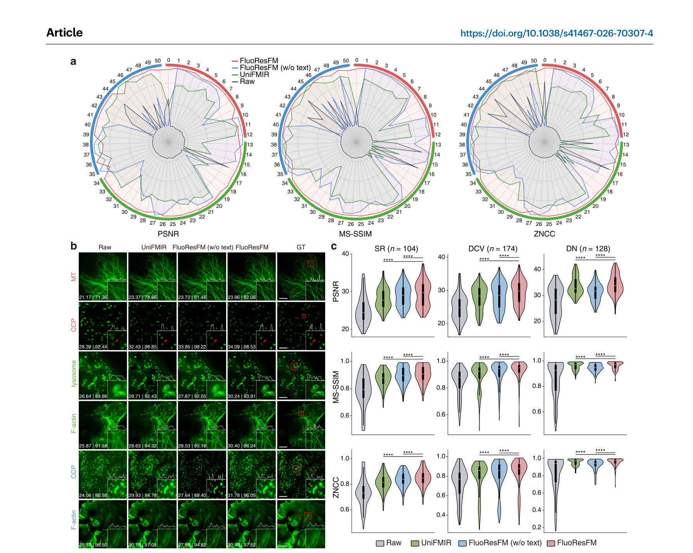
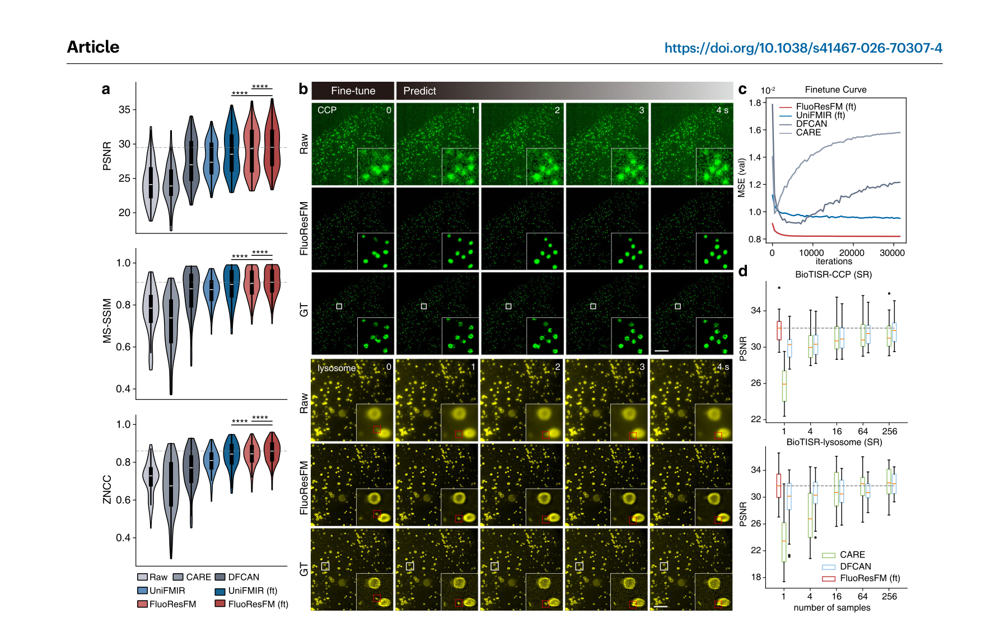
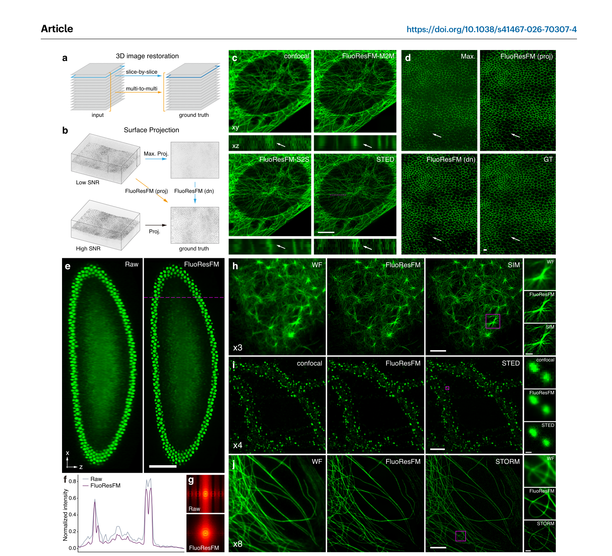
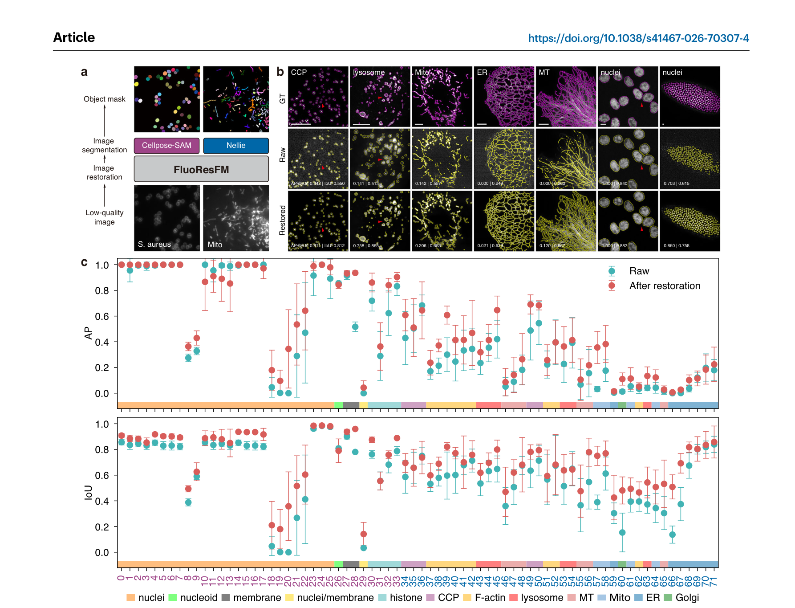

# FluoResFM：荧光显微图像多任务跨分布恢复的基础模型

> **原文标题**: A foundation model for multi-task cross-distribution restoration of fluorescence microscopy images  
> **发表期刊**: *Nature Communications* (2026) 17:3729  
> **DOI**: [10.1038/s41467-026-70307-4](https://doi.org/10.1038/s41467-026-70307-4)  
> **收稿日期**: 2025-08-29 | **接收日期**: 2026-02-24  
> **作者**: Qiqi Lu¹,²,³, Xiuli Liu⁴, Qianjin Feng¹,²,³, Shaoqun Zeng⁴ ✉, Shenghua Cheng¹,²,³ ✉  
> **所属机构**:  
> 1. 南方医科大学 生物医学工程学院  
> 2. 广东省医学图像处理重点实验室  
> 3. 广东省医学影像与诊断技术工程实验室  
> 4. 华中科技大学 武汉光电国家研究中心 生物医学光子学教育部重点实验室  

---

## 目录

- [一、论文概述](#一论文概述)
- [二、研究背景与动机](#二研究背景与动机)
- [三、方法：FluoResFM 模型架构](#三方法fluoresfm-模型架构)
- [四、训练数据](#四训练数据)
- [五、主要实验结果](#五主要实验结果)
- [六、微调与迁移学习](#六微调与迁移学习)
- [七、下游分割任务提升](#七下游分割任务提升)
- [八、讨论与局限](#八讨论与局限)
- [九、关键结论](#九关键结论)
- [十、附录：实验设置与资源](#十附录实验设置与资源)

---

## 一、论文概述

### 一句话总结

**FluoResFM** 是一个基于文本先验信息引导的荧光显微图像恢复基础模型，能够在**统一框架**内完成**去噪（Denoising）、去卷积（Deconvolution）、超分辨率（Super-resolution）** 三大任务，并在**超过20种生物结构**、**多种成像条件**下展现出优异的泛化能力。

### 核心创新点

| 创新点 | 说明 |
|--------|------|
| 🧩 **多任务统一** | 单模型同时处理去噪、去卷积、超分辨率三种任务 |
| 📝 **文本先验引导** | 利用任务类型、结构类型、成像条件等文本信息指导图像恢复 |
| 🔄 **跨分布泛化** | 在超20种生物结构、多种显微模态上泛化良好 |
| 💡 **单样本微调** | 仅需1张图像微调即可达到传统模型数百张数据的性能 |
| 🔧 **易扩展** | 可适配3D恢复、表面投影、各向同性重建、多倍率超分等新任务 |
| 🎯 **提升下游任务** | 恢复后的图像可显著提升细胞/细胞器分割性能 |

---

## 二、研究背景与动机

### 2.1 荧光显微成像的挑战

- 荧光显微镜受限于**光照暴露、成像速度、时空分辨率**等因素，图像常被**噪声、模糊、欠采样**所影响
- 需要通过**去噪、去卷积、超分辨率**等图像恢复手段来改善图像质量

### 2.2 现有方法的局限性

| 问题 | 描述 |
|------|------|
| **任务特定性** | 现有模型通常针对单一任务训练（如只做去噪或只做超分），不同任务需要不同模型 |
| **数据分布局限** | 训练数据往往来自特定成像对象和条件，泛化能力差 |
| **分布偏移导致幻觉** | 模型在分布外数据上可能产生**虚假结构（hallucination）** |
| **过拟合风险** | 标注数据获取困难、数据集规模小，容易过拟合 |

> **具体例子**: 在CCP（网格蛋白包被 pits）上训练的CARE模型，用于恢复MT（微管）图像时，会错误地生成CCP-like的结构（Supplementary Fig. 1）。

### 2.3 基础模型的机遇

- 基础模型（Foundation Model）在自然图像处理领域已展现出强大的泛化能力
- 先前的 **UniFMIR** 使用共享Swin Transformer层+任务特定的头/尾来处理多任务，但未充分考虑**成像对象和条件带来的数据异质性**

---

## 三、方法：FluoResFM 模型架构

### 3.1 整体架构

```
输入: 低质量图像 + 文本先验信息 → FluoResFM → 输出: 高质量恢复图像
```

### 3.2 文本先验信息

文本先验包含三类信息，拼接成一个文本输入：

| 类别 | 内容 |
|------|------|
| **任务类型 (Task type)** | denoising / deconvolution / super-resolution |
| **结构类型 (Structure type)** | CCP, ER, F-actin, MT, nucleus, mitochondria 等 |
| **成像条件 (Imaging condition)** | 显微镜类型（宽场、共聚焦、STED、SIM等）+ 参数设置 + 荧光指示剂 |

**输入和目标图像的元数据都会包含在内**，例如：
- 输入图像的显微镜类型和参数（Input metadata）
- 目标（Target）图像所使用的显微镜类型和参数

### 3.3 网络结构细节

| 组件 | 说明 |
|------|------|
| **骨干网络** | **文本条件 U-Net**（Text-conditional U-Net） |
| **编码器-解码器** | 含跳跃连接（skip connections） |
| **文本编码器** | **BiomedCLIP** 预训练文本编码器（在多样化生物医学数据上预训练） |
| **融合方式** | **交叉注意力机制（Cross-attention）**——在每个尺度的编码器和解码器中进行文本与图像特征融合 |
| **损失函数** | **MAE损失（L1 loss）**——计算恢复图像与高质量GT图像之间的平均绝对误差 |

### 3.4 网络结构示意图

```
低质量图像 → [Conv] → [ResBlock + CrossAttention × N] → ... → [Conv] → 恢复图像
                           ↑                                         
                     文本嵌入 (BiomedCLIP)
                           ↑
                 文本先验 (任务+结构+条件)
```

### 3.5 关于结构化分类嵌入（SCE）的消融

作为对比，FluoResFM (SCE) 将非结构化的文本嵌入替换为**结构化的分类嵌入**（为每个任务、结构、显微镜类型分配唯一ID并映射为可学习嵌入向量）。实验表明：
- 在内部数据集上 SCE 表现略有下降
- 但在外部数据集上 SCE 的**泛化能力更好**（Fig. 4f）

---

## 四、训练数据

### 4.1 数据规模

| 指标 | 数值 |
|------|------|
| **训练数据** | 超 **430万** 对低质量-高质量图像块（4,303,086 pairs） |
| **内部测试数据集** | 302 个 |
| **外部未见数据集** | 51 个 |
| **生物结构类型** | 20+ 种 |

### 4.2 覆盖的成像模态

宽场显微镜（Wide-field）、结构光照明显微镜（SIM）、即时结构光照明显微镜（Instant SIM）、共聚焦显微镜（Confocal）、多光子显微镜（Multi-photon）、光片显微镜（Light-sheet）、双光子显微镜（Two-photon）、受激发射损耗显微镜（STED）

### 4.3 覆盖的生物结构

CCP（网格蛋白包被 pits）、ER（内质网）、F-actin（肌动蛋白丝）、MT（微管）、Myosin-IIA（肌球蛋白IIA）、Nucleus（细胞核）、Histone（组蛋白）、Nuclear-envelope（核膜）、Membrane（细胞膜）、Granule（颗粒）、Tubulin（微管蛋白）、Nucleoid（类核）、Lysosome（溶酶体）、Survivin（存活素）、NCC（神经嵴细胞）、NPC（核孔复合物）、MreB、Mitochondria / Mito（线粒体）、Chromosome（染色体）、Golgi（高尔基体）

### 4.4 数据预处理

- **强度归一化**: 基于百分位数的归一化（3% ~ 99.5%）
- **图像块尺寸**: 64×64 像素
- **超分任务**: 低质量图像使用最近邻插值上采样到与GT相同尺寸
- **训练/测试划分**: 约 80:20
- **去除纯噪声块**

---

## 五、主要实验结果

### 5.1 评价指标

| 指标 | 全称 | 说明 |
|------|------|------|
| **PSNR** | Peak Signal-to-Noise Ratio | 像素级差异 |
| **MS-SSIM** | Multi-Scale Structural Similarity Index | 多尺度结构相似性 |
| **ZNCC** | Zero-Normalized Cross-Correlation | 零归一化互相关 |
| **RSE** | Resolution-Scaled Error | 分辨率缩放误差 |
| **RSP** | Resolution-Scaled Pearson coefficient | 分辨率缩放皮尔逊系数 |

### 5.2 内部数据集表现（Fig. 2）


*图 2：内部数据集上的性能比较。a 各数据集的定量指标雷达图。b 各任务代表性恢复结果的可视化对比（红色箭头标注关键差异区域）。c 所有内部数据集上各任务的平均定量指标。*

- FluoResFM 在**大多数内部数据集**上取得了最高的 **PSNR、MS-SSIM、ZNCC、RSP** 和最低的 **RSE**
- **相比 UniFMIR**:
  - 更好地分辨紧密排列的结构（如NPC、MT的超分辨率）
  - 重建更连续、更清晰的MT和ER网络
  - UniFMIR 将邻近物体合并或产生碎片化重建
- **无文本引导的变体（FluoResFM w/o text）**:
  - 倾向于对所有输入图像去模糊，无法正确完成去噪任务
  - 在去卷积和超分任务上表现也较差
  - 说明**没有任务先验的统一模型会导致不可控的预测**

### 5.3 外部未见数据集的泛化表现（Fig. 3）


*图 3：外部未见数据集上的泛化性能比较。a 各外部数据集的定量指标雷达图。b 各任务代表性恢复结果的对比。c 所有外部数据集上各任务的平均定量指标。*

- 在 **51 个外部未见数据集**上进行评估
- FluoResFM 在三个任务上均表现**显著优于** UniFMIR 和无文本引导的变体
- 即使未在这些数据上训练，FluoResFM 仍能准确恢复出接近GT参考的结构细节

---

## 六、微调与迁移学习

### 6.1 单样本微调性能（Fig. 5）


*图 5：单样本微调 FluoResFM。a 不同方法在 12 个外部数据集上的定量比较。b 活细胞动态成像中微调 FluoResFM 的恢复结果。c 不同模型在训练过程中的 PSNR 曲线。d 不同训练数据规模下 CARE 和 DFCAN 与单样本微调 FluoResFM 的性能对比。*

| 方法 | 训练数据量 | 性能 |
|------|-----------|------|
| CARE (从头训练) | 1 张图像 | 最低，甚至不如原始低质量输入 → 严重过拟合 |
| DFCAN (从头训练) | 1 张图像 | 优于CARE但远不如FluoResFM → 过拟合 |
| UniFMIR (预训练+微调) | 1 张图像 | 较好，但低于 FluoResFM |
| **FluoResFM (预训练+微调)** | **1 张图像** | **最佳，接近模型在完整数据集上的表现** |

> **微调策略**: 仅更新 U-Net 骨干的**第一层和最后一层卷积层**参数，其他参数冻结。

### 6.2 性能对比 — 需要多少数据才能匹敌？

- CARE 和 DFCAN 需要**数百张图像**才能达到 FluoResFM 单样本微调的效果（Fig. 5d）

### 6.3 动态成像应用

- 在 CCP 和溶酶体的活细胞成像中：
  - 使用 t=0s 的图像微调 FluoResFM
  - 然后应用于后续时间点的图像恢复
  - 显著提高了 SNR 和分辨率，更准确追踪动态变化

### 6.4 扩展到其他任务（Fig. 6）


*图 6：通过单样本微调将 FluoResFM 迁移到其他恢复任务。a 3D 图像恢复的两种策略示意图。b 表面投影的两种策略示意图。c 3D 图像恢复结果对比。d 表面投影结果对比。e,f 各向同性重建结果。g 各向同性重建前后的傅里叶频谱分析。h-j 3×、4× 和 8× 超分辨率结果。*

| 扩展任务 | 方法 | 效果 |
|----------|------|------|
| **3D 图像恢复** | 逐切片（S2S）或多通道输入输出（M2M） | M2M 利用邻层信息，轴向结构更连续 |
| **表面投影** | 先最大投影再降噪（dn），或多通道直接投影（proj） | 直接投影保留更多细节 |
| **各向同性重建** | 改善轴向（z轴）分辨率 | 有效恢复频率，减少混叠伪影 |
| **超分辨率（3×/4×/8×）** | 单样本微调适配不同放大倍数 | 显著提升输入质量，接近高质量参考 |

---

## 七、下游分割任务提升

### 7.1 方法

```
低质量图像 → FluoResFM 恢复 → Cellpose-SAM / Nellie 分割 → 更精确的掩膜
```

### 7.2 效果（Fig. 7）


*图 7：提升现有细胞和细胞器分割模型的性能。a FluoResFM 作为分割预处理工具的流程示意图。b 在退化图像和 FluoResFM 恢复图像上的分割结果对比。c 各数据集上分割精度的定量比较。*

| 结构 | 直接分割的问题 | FluoResFM 恢复后 |
|------|---------------|------------------|
| CCP / 细胞核 | 漏检（missing） | 更完整检出 |
| 溶酶体 / 细胞核 | 连体（connected） | 正确分离 |
| 线粒体 / ER / MT | 碎片化（fragmented） | 连续完整 |
| **AP@0.5 和 IoU** | 较低 | **显著提升** |

在 **72 个数据集**上进行了评估，涵盖多种细胞和细胞器结构。

---

## 八、讨论与局限

### 8.1 优势总结

1. **文本先验有效控制恢复结果**：通过改变文本提示可控制重建的结构模式
2. **跨分布泛化能力强**：在多种未见过的数据上表现良好
3. **数据效率极高**：单样本微调达到传统方法数百样本的效果
4. **即插即用**：可作为预处理工具提升下游分析任务
5. **用户友好**：提供 napari 插件

### 8.2 局限性

| 局限 | 说明 |
|------|------|
| **训练数据覆盖面仍有限** | 尽管覆盖了20+结构和多种模态，但显微成像的多样性极其丰富 |
| **3D能力受限** | 当前使用2D多通道方式近似3D，真正全3D网络可能更优，但缺乏大规模3D训练数据 |
| **计算资源需求高** | 对于高分辨率图像，内存占用和推理时间较长（Supplementary Table 8） |
| **架构可进一步优化** | SwinIR、Restormer 等更先进的架构可能提升效率和性能 |

---

## 九、关键结论

1. ✅ **FluoResFM 是首个在统一框架内通过文本先验信息处理荧光显微图像多任务恢复的基础模型**
2. ✅ **在 430万+ 图像块上训练，覆盖 3 大任务、20+ 生物结构、多种成像模态**
3. ✅ **内部 302 个和外部 51 个数据集的评估证实其优越性能和泛化能力**
4. ✅ **单样本微调达到传统模型数百样本的训练效果**
5. ✅ **可轻松扩展到 3D 恢复、表面投影、各向同性重建、多倍率超分等新任务**
6. ✅ **有效提升下游细胞/细胞器分割性能（Cellpose-SAM、Nellie）**
7. ✅ **提供 napari 插件，便于生物研究社区使用**

---

## 十、附录：实验设置与资源

### 10.1 训练配置

| 超参数 | 设置 |
|--------|------|
| 深度学习框架 | PyTorch 2.6.0 |
| 优化器 | AdamW |
| 批大小 | 16 |
| 总迭代次数 | 700,000 |
| 初始学习率 | 1×10⁻⁵，每 100,000 迭代减半 |
| 硬件 | Intel Core i9-14900K + NVIDIA GeForce RTX 4090D (24GB) |

### 10.2 代码与数据资源

| 资源 | 链接 |
|------|------|
| GitHub 代码 | [github.com/qiqi-lu/fluoresfm](https://github.com/qiqi-lu/fluoresfm) |
| napari 插件 | [github.com/qiqi-lu/napari-fluoresfm](https://github.com/qiqi-lu/napari-fluoresfm) |
| Zenodo 数据 | [doi:10.5281/zenodo.18382702](https://doi.org/10.5281/zenodo.18382702) |
| 插件使用视频 | [bilibili.com/video/BV16JeFzuEof](https://www.bilibili.com/video/BV16JeFzuEof) |

### 10.3 对比方法

- **CARE**: Content-Aware Image Restoration (Weigert et al., Nat. Methods 2018)
- **DFCAN**: Deep Fourier Channel Attention Network (Qiao et al., Nat. Methods 2021)
- **UniFMIR**: Unified Foundation Model for Image Restoration (Ma et al., Nat. Methods 2024)

### 10.4 统计方法

- 组间比较: **单侧 Wilcoxon 符号秩检验**
- 显著性阈值: p < 0.05
- 随机种子固定

---

> **整理日期**: 2026-07-26  
> **说明**: 本文档为论文 [FluoResFM (Nature Communications, 2026)](https://doi.org/10.1038/s41467-026-70307-4) 的中文翻译与关键信息提炼，用于快速理解和参考。
