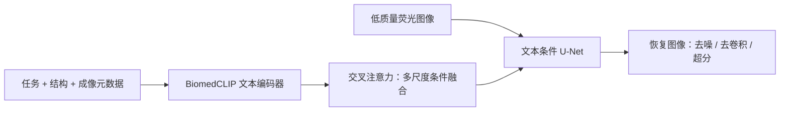

# FluoResFM 论文速读

> 面向初次阅读者的快速导读，不替代论文的 Methods、图注与补充材料。
> Lu *et al.*，*A foundation model for multi-task cross-distribution restoration of fluorescence microscopy images*，*Nature Communications* 17, 3729 (2026). [DOI](https://doi.org/10.1038/s41467-026-70307-4)

## 先用一分钟回答三个问题

**它解决什么问题？**

荧光显微恢复常针对单一任务、样本结构或成像条件训练；当噪声、模态或样本分布改变时，模型可能失效或生成不可信结构。FluoResFM 试图用一个模型统一处理去噪、去卷积与超分辨率，并以文本提供任务和成像背景。

**它的核心方法是什么？**

低质量图像与文本先验共同输入模型。文本包括三部分：任务、生物结构、输入/目标成像条件。BiomedCLIP 编码文本，交叉注意力将其融入文本条件 U-Net 的多尺度图像特征，输出相应的恢复图像。

**最重要的贡献是什么？**

它不只是让图像“更清晰”，而是将任务语义、样本结构和成像条件显式作为可检查的先验，使恢复由“图像输入”与“条件信息”共同约束。

## 阅读时重点看什么

1. **数据覆盖与任务定义**：训练数据包含哪些结构、成像模态和恢复任务？输入与目标的物理对应关系是什么？
2. **文本条件如何进入模型**：文本编码器是否更新？交叉注意力在网络的哪些尺度使用？
3. **主实验是否公平**：基线、训练数据、预处理和评价协议是否一致？应结合图注与 Methods 阅读 PSNR、MS-SSIM、ZNCC、RSE、RSP 等结果。
4. **分布外证据**：内部数据以外的样本、模态和任务表现如何？这比单一数据集的最佳分数更能说明模型边界。
5. **单样本微调与下游任务**：微调使用多少样本、是否有保留集？恢复改进是否同步改善分割等下游结果？

## 论文报告的证据范围

- 作者报告约 430 万对图像块，并在内部与外部未见数据上比较 FluoResFM、UniFMIR 和无文本条件变体等方法。
- 作者还报告单样本微调、新任务扩展，以及将恢复结果用于下游分割的实验。
- 这些均是论文作者的报告结论。具体数据划分、统计显著性和数值应以原文 Methods、图注与补充材料为准。

## 不应忽略的边界

- 文本条件是否独立控制输出，不能只凭一张更锐利的图判断；需要严格的单因素消融与配对评价。
- 恢复指标不能完全排除幻觉结构。尤其无参考分辨率指标，不应脱离参考保真度、原始输入和成像知识单独解释。
- 实际新样本的可靠性取决于训练覆盖、元数据质量和目标实验条件；应在目标样本上作定量与定性验证。

## 最小上手路径

1. 先阅读摘要、Fig. 1 和 Methods 中的任务/数据定义，明确要做的是去噪、去卷积还是超分辨率。
2. 使用 napari 插件或上游测试脚本对一组已知示例运行推理。
3. 核对输入、目标、像素尺寸和成像条件是否匹配；不要仅据图像尺寸猜测任务。
4. 有参考图时同时检查多个保真指标与定性图；无参考图时将结果视为待验证候选，而非真实结构结论。

更详细的逐节阅读见 [FluoResFM 论文精读](FluoResFM_论文精读.md)，完整中文译文见 [FluoResFM 完整翻译](FluoResFM_完整翻译.md)。
