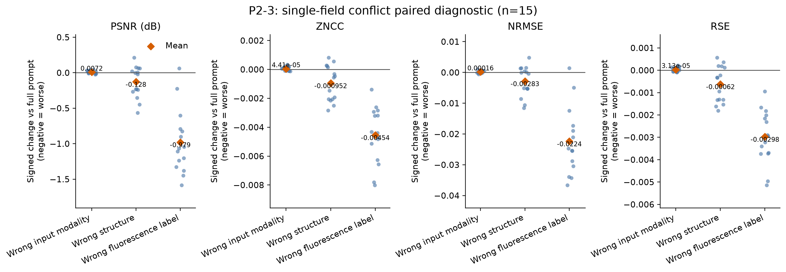

# P2-3：单字段条件冲突定位

> 状态：已完成；证据等级：P2 补充实验；日期：2026-07-28。

## 范围与运行

- 数据：BioSR_MT 捆绑测试图 15 张；不是独立保留集或论文协议复现。
- 对照：P2-1 严格复跑的规范完整提示 `01_full`，未重新生成。
- 条件：仅将输入模态从 wide-field 改为 linear structured illumination；仅将结构从 microtubule 改为 F-actin；仅将荧光标记从 mEmerald (GFP) 改为 mCherry。
- 固定变量：权重、输入、完整提示的其余文本、2×尺度、推理参数和本地评估逻辑。
- 运行：先完成 2 图 × 3 条件 smoke test；完整运行 15 图 × 3 条件。GPU 仅生成预测，所有指标与统计在本地 `napari-fluoresfm` 环境完成。
- 本地工件：`experiments/mt_condition_field_conflicts/20260728_p2-3_full15_r1/`（原始 P2-3 TIFF）及 `experiments/mt_condition_field_conflicts/20260728_p2-3_analysis_full15_r1/`（与 P2-1 基线硬链接组成的配对评估视图，均 Git 忽略）。云端归档在传回时已校验 SHA-256：`dcfb833ea48e6e6931fac4c2c94e1b02ca649d50804940c43c0c3e13c2587c15`；2026-08-03 已将工作区中的传输压缩副本移入 Windows 回收站，原始 TIFF 与分析视图仍保留。

## 结果

| 条件 | PSNR ↑ | SSIM ↑ | MS-SSIM ↑ | ZNCC ↑ | RSP ↑ | NRMSE ↓ | RSE ↓ | DA nm ↓ |
|---|---:|---:|---:|---:|---:|---:|---:|---:|
| 完整提示 | 26.466 | 0.819 | 0.934 | 0.967 | 0.967 | 0.187 | 0.046 | 133.5 |
| 错误输入模态 | 26.474 | 0.820 | 0.935 | 0.967 | 0.967 | 0.186 | 0.046 | 133.5 |
| 错误结构 | 26.339 | 0.817 | 0.934 | 0.966 | 0.966 | 0.189 | 0.046 | 142.6 |
| 错误荧光标记 | 25.488 | 0.812 | 0.931 | 0.962 | 0.963 | 0.209 | 0.049 | 132.1 |

所有条件均为 15 张且与完整提示逐图配对。相对 `01_full` 的 PSNR 平均差依次为 +0.007、−0.128、−0.979；24 次 Bonferroni 校正后，只有错误荧光标记的 PSNR 下降仍显著（`p=0.002930`）。错误结构的 DA 平均恶化 +9.170 nm（校正后 `p=0.015640`），但其有参考保真度指标在校正后未显著。错误输入模态的 SSIM/MS-SSIM 虽有很小的统计变化，但 PSNR、ZNCC、NRMSE、RSE、RSP 和 DA 均不显著，不能解释为质量提升。完整结果见 `full_metrics.csv`、`full_metrics_summary.csv` 和 `full_paired_summary.csv`。

## 可支持表述与边界

在这 15 张图、该权重版本和该提示模板中，错误荧光标记比错误输入模态或错误结构更容易造成可检测的有参考保真度损失。错误结构对 DA 的变化与有参考指标未形成一致证据；因此只能将其视为待复核的诊断信号。

这不是对任何字段的全局重要性、真实实验元数据风险或其他数据集泛化性的结论。替代解释包括文本编码器对 mEmerald/GFP 与 mCherry 词元的训练分布偏好、F-actin 与 microtubule 的形态先验差异，以及当前小测试集导致的效应估计不稳定。DA 与有参考指标排序不一致，不能单独解读为结构恢复质量改变。

## 后续衔接

优先做 P2-4：不再产生新 TIFF，而是在 P2-1 至 P2-3 的已有预测上做逐图指标一致性、输出差异与频谱/边缘诊断，定位 DA 和有参考指标冲突的样本。
