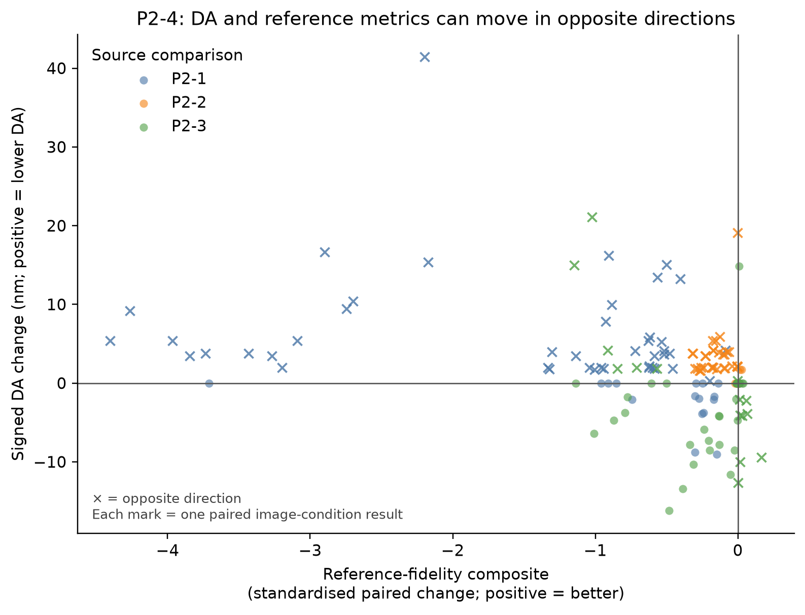

# P2-4：指标可靠性与方向冲突诊断

> 状态：已完成；证据等级：P2 诊断分析；日期：2026-07-28。

## 范围与运行

- 数据：P2-1、P2-2、P2-3 已完成的 BioSR_MT 预测；共 10 个非完整提示条件、每条件 15 张图，即 150 个逐图配对差异。
- 不新增 GPU 推理；本地复用既有 `full_metrics.csv` / `isolated_full_metrics.csv` 和 TIFF。
- 方法：将 PSNR、SSIM、MS-SSIM、ZNCC、RSP、NRMSE、RSE 统一为“增大表示参考保真度变好”的带符号差异；DA 则以 `baseline DA − condition DA` 表示“数值更低”。参考保真度综合量仅用于定位冲突，不是新的质量指标。
- 诊断：计算 DA 与各有参考指标的 Spearman 相关；列出方向相反的逐图样本；对冲突最强的 30 个样本计算相对参考图的 Sobel 边缘能量误差和高频能量比例误差。
- 本地工件：`experiments/mt_metric_reliability/20260728_p2-4_existing_predictions_r2/`（Git 忽略）；含逐图差异、条件汇总、相关性、异常清单和散点图。

## 结果

| 比较对象 | n | 与带符号 DA 的 Spearman ρ | 名义双侧 p |
|---|---:|---:|---:|
| PSNR | 150 | −0.472 | 1.10e-09 |
| SSIM | 150 | −0.461 | 2.93e-09 |
| MS-SSIM | 150 | −0.416 | 1.16e-07 |
| ZNCC | 150 | −0.349 | 1.18e-05 |
| RSP | 150 | −0.351 | 1.08e-05 |
| NRMSE（已反向） | 150 | −0.463 | 2.37e-09 |
| RSE（已反向） | 150 | −0.355 | 8.35e-06 |
| 参考保真度综合量 | 150 | −0.420 | 8.45e-08 |

150 个逐图条件差异中，89 个（59%）的 DA 与参考保真度综合量方向相反。最明显的条件层面模式包括：任务改写为 15/15、全提示改写为 14/15、错误目标模态为 14/15、联合目标元数据错误为 14/15。它们的参考指标通常下降，而 DA 同时变小；因此 DA 的单独“改善”不能被解释为恢复质量提升。

对冲突最强的 30 个样本，边缘与高频误差没有呈现跨条件一致的单向模式。该附加诊断不足以将 DA 冲突归因于特定形态变化；异常清单仅供后续人工审阅。完整数值见 `metric_da_spearman.csv`、`condition_direction_summary.csv`、`paired_metric_deltas.csv` 与 `discordant_samples_with_edge_frequency.csv`。

## 可支持表述与边界

在当前预测、参考图和实现版本中，DA 与多种有参考保真度指标存在稳定的方向冲突，故 DA 不适合作为该改进线中单独的主判据。后续报告应优先并列 PSNR、MS-SSIM、ZNCC、NRMSE、RSE 与 RSP，并将 DA 标为辅助诊断。

相关性 p 值仅为描述性数值：150 行包含同一 15 张图在多个条件下的重复配对，不能视为 150 个独立样本，也未用于泛化显著性推断。替代解释包括 DA 实现对频谱/平滑变化的敏感性、归一化和评估参数的影响，以及不同指标本来衡量不同性质。边缘/高频代理本身未经过独立形态标注验证。

## 后续衔接

在没有独立、逐文件核验的保留集前，暂停继续扩展提示扰动。下一优先级是将已观察到的荧光标记敏感性和 DA 冲突，在独立数据上按同一预注册条件重复；若该数据仍不可用，则先完成协议与元数据审计，而不是提出模型改动或泛化结论。
