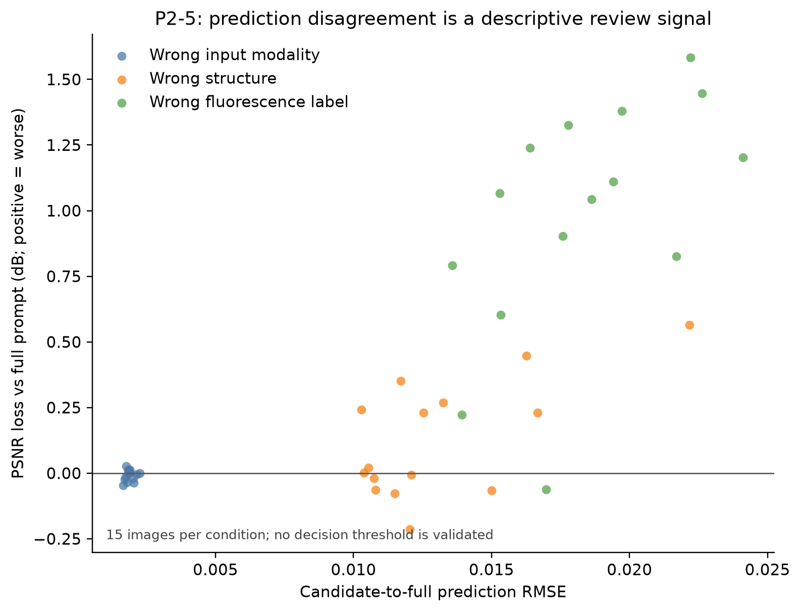

# P2-5：提示分歧作为风险信号的原型

> 状态：已完成；证据等级：P2 探索性诊断；日期：2026-07-29。

## 范围与运行

- 数据：P2-3 的 BioSR_MT 15 张图，复用完整提示与三个单字段错误条件的已有 TIFF；未新增 GPU 推理。
- 目标：评估“候选提示输出与完整提示的分歧”能否作为风险提示。该原型不混合输出、不自动选择候选提示，也不把分歧解释为无参考质量分数。
- 分歧：逐图独立 3%–99.5% 归一化后，计算完整提示与候选提示预测之间的 MAE、RMSE、SSIM。
- 验证：将分歧与同图相对完整提示的有参考指标变化作条件内 Spearman 相关；小样本及多比较下仅作探索性检查。
- 本地工件：`experiments/mt_prompt_disagreement/20260729_p2-5_existing_p2-3_r1/`（Git 忽略）；含 45 个预测对的逐图分歧和全部相关性表。

## 结果

| 候选提示冲突 | 预测 MAE | 预测 RMSE | 预测间 SSIM | 相对完整提示 PSNR |
|---|---:|---:|---:|---:|
| 错误输入模态 | 0.00122 | 0.00189 | 0.99980 | +0.007 dB |
| 错误结构 | 0.00806 | 0.01307 | 0.99180 | −0.128 dB |
| 错误荧光标记 | 0.01260 | 0.01836 | 0.99072 | −0.979 dB |

错误荧光标记的输出分歧最大，且逐图 MAE/RMSE 与多项保真度损失呈正向的未校正关联；其中 RMSE 与 MS-SSIM 损失的 Spearman `ρ=0.714`、名义 `p=0.00277`。错误结构也有同方向趋势，例如预测间 SSIM 分歧与 PSNR 损失 `ρ=0.586`、名义 `p=0.0218`。错误输入模态未显示一致关系。

本分析共有 3 个条件 × 3 个分歧量 × 7 个保真度指标 = 63 项相关性检查；上述名义 p 值经该范围的 Bonferroni 校正后均不显著。因此当前没有足够证据为“提示分歧风险”设定阈值或部署自动拒绝规则。完整表见 `per_image_prompt_disagreement.csv` 和 `within_condition_spearman.csv`。

## 可支持表述与边界

在这 15 张图和这三类人工冲突中，输出分歧能够区分明显的错误荧光标记与几乎无效应的错误输入模态，作为人工审阅的候选排序信号有一定可行性。但它尚不是校准的不确定性估计，也不能用于挑选“更好”的候选输出。

替代解释包括：分歧和参考误差都由同一错误提示驱动，而非分歧本身预测质量；归一化影响了像素分歧大小；不同结构/模态候选集会改变排名。独立保留集、预先冻结的候选提示集和预注册阈值验证前，不应将该信号用于实际自动化决策。

## 后续衔接

当前示例数据已完成可解释的 P2 诊断范围。下一步优先等待或获得可审计的 RawSIM→WF/GT 协议后，在独立图像上复验 P2-3 的荧光标记敏感性、P2-4 的 DA 冲突和本 P2-5 的风险排序；在此之前不继续增加同一 15 张图上的提示扰动。
