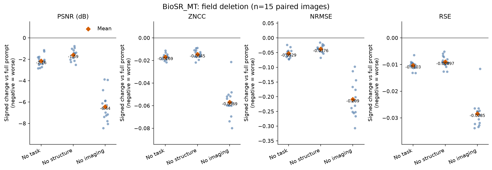
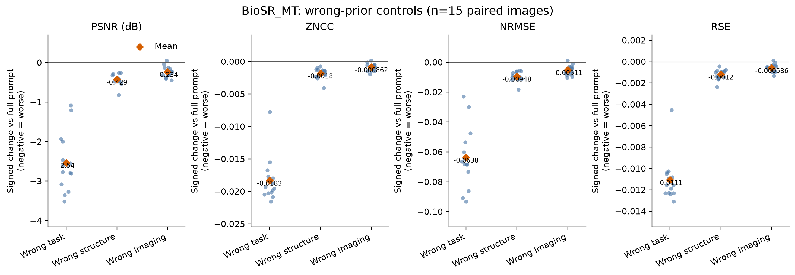
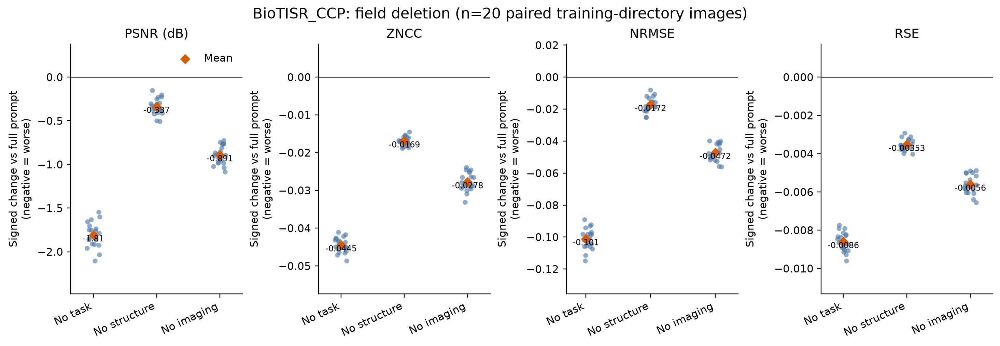

# 规范提示实验：结果与边界

## 共同方法

完整提示直接取自随附 `dataset_text_ALL.txt` 中对应数据集的超分辨率文本；每个删除或错误条件一次只改变一个字段。预测在 GPU 上生成，所有指标、配对统计和图表在本地运行。每幅预测与同名 SIM 参考图各自进行 0.3%–99.5% 百分位归一化后计算。

BioSR_MT 的训练工作簿记录 `sf_lr=2` 和 62.6→31.3 nm；BioTISR_CCP 的微调工作簿记录 `sf_lr=2` 和 60.4→30.2 nm。这支持本实验使用 2×超分辨率映射。工作簿并非当前 MT 测试图或 CCP 样本的逐文件元数据，故不应称为官方测试协议或论文复现。

## BioSR_MT：字段删除

范围：15 张捆绑测试图像；完整提示来自 `example/data/text/train/dataset_text_ALL.txt`。每个条件均为 15 张，比较以同一图像的完整提示输出为配对基线。

| 条件 | PSNR ↑ | SSIM ↑ | MS-SSIM ↑ | ZNCC ↑ | RSP ↑ | NRMSE ↓ | RSE ↓ | DA nm ↓ |
|---|---:|---:|---:|---:|---:|---:|---:|---:|
| 完整提示 | 26.467 | 0.819 | 0.934 | 0.967 | 0.967 | 0.187 | 0.046 | 133.3 |
| 缺任务 | 24.310 | 0.764 | 0.912 | 0.950 | 0.950 | 0.240 | 0.056 | 106.6 |
| 缺结构 | 24.878 | 0.777 | 0.912 | 0.952 | 0.953 | 0.224 | 0.055 | 200.2 |
| 缺成像条件 | 20.032 | 0.652 | 0.855 | 0.910 | 0.910 | 0.395 | 0.074 | 140.6 |

三个删除条件的七项有参考图指标均变差；Wilcoxon 双侧配对检验经 24 次 Bonferroni 校正后均为 `p=0.001465`。缺成像条件的 PSNR 降幅最大（−6.44），其次为缺任务（−2.16）和缺结构（−1.59）。缺任务的 DA 反而更小，说明 DA 不能脱离参考图保真度解释。

## BioSR_MT：错误先验

范围与基线同上。三个新条件均复用字段删除实验的完整提示输出，仅替换一个字段：任务改为去卷积、结构改为线粒体、目标模态改为宽场。

| 条件 | PSNR ↑ | SSIM ↑ | MS-SSIM ↑ | ZNCC ↑ | RSP ↑ | NRMSE ↓ | RSE ↓ | DA nm ↓ |
|---|---:|---:|---:|---:|---:|---:|---:|---:|
| 完整提示 | 26.467 | 0.819 | 0.934 | 0.967 | 0.967 | 0.187 | 0.046 | 133.3 |
| 错误任务 | 23.931 | 0.766 | 0.912 | 0.949 | 0.949 | 0.250 | 0.057 | 101.1 |
| 错误结构 | 26.038 | 0.814 | 0.931 | 0.965 | 0.965 | 0.196 | 0.047 | 149.2 |
| 错误成像 | 26.233 | 0.818 | 0.934 | 0.966 | 0.966 | 0.192 | 0.046 | 130.4 |

错误任务和错误结构的七项有参考图指标均一致变差（校正后 `p=0.001465`）。错误成像的 PSNR、ZNCC、NRMSE 和 RSE 有小幅且显著的变化（校正后 `p=0.004395`），SSIM、MS-SSIM 和 RSP 不显著；其效应远小于删除成像字段。

可支持的表述是：在这 15 张图和这一个错误模态替换中，任务文字比结构文字更敏感，而成像字段的删除比该错误模态替换影响更大。合理替代解释包括模型主要依赖图像输入、所测试的模态替换不足够强，或指标未捕获形态层面的变化。不能将此推广为模型对所有成像语义不敏感。

## BioTISR_CCP：字段删除

范围：20 张捆绑训练目录样本；完整提示来自 `example/data/text/finetune/dataset_text_ALL.txt`。这是一项目录内提示敏感性筛选，不是独立测试或泛化实验。

| 条件 | PSNR ↑ | SSIM ↑ | MS-SSIM ↑ | ZNCC ↑ | RSP ↑ | NRMSE ↓ | RSE ↓ | DA nm ↓ |
|---|---:|---:|---:|---:|---:|---:|---:|---:|
| 完整提示 | 26.787 | 0.245 | 0.854 | 0.910 | 0.914 | 0.437 | 0.041 | 64.5 |
| 缺任务 | 24.979 | 0.260 | 0.858 | 0.865 | 0.873 | 0.539 | 0.050 | 68.0 |
| 缺结构 | 26.450 | 0.437 | 0.889 | 0.893 | 0.894 | 0.455 | 0.045 | 71.9 |
| 缺成像条件 | 25.896 | 0.258 | 0.852 | 0.882 | 0.889 | 0.485 | 0.047 | 67.7 |

去除任务字段的保真度损失最大（PSNR −1.81），去除成像条件次之（−0.89）。去除结构时 SSIM 和 MS-SSIM 上升、其余有参考指标变差；平滑输出及 SSIM 对其的偏好是一个合理解释，因此不能将该项上升解释为重建更好。24 个配对比较的 Bonferroni 校正后 `p<0.005`，但 20 个训练目录样本不足以支持跨数据集排序。

## 下一步验证

1. 获取 MT 测试图的原始任务与成像元数据，确认逐文件映射。
2. 用语义等价改写和更多错误成像参数，分离措辞、字段存在性与真实元数据的作用。
3. 加入形态学或下游分割评估，检查像素指标的变化是否对应结构保留。
4. 在独立保留集上比较零样本推理与不同样本数的微调。
