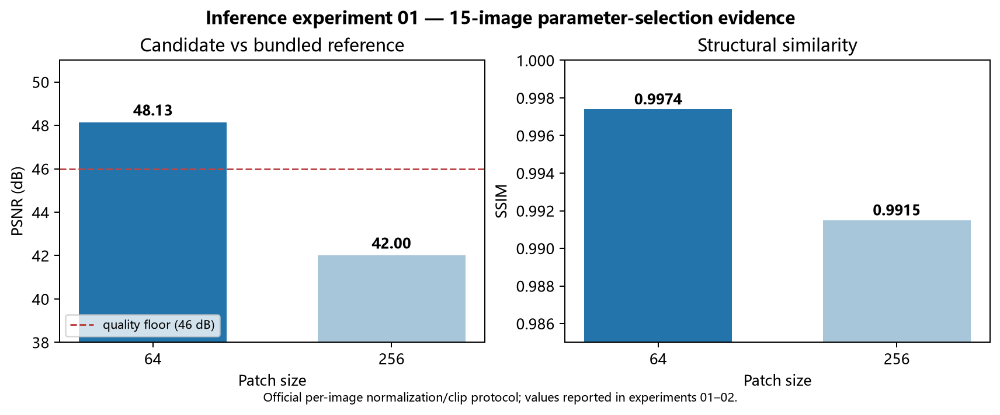

# 推理实验-01｜BioSR-MT FluoResFM 参数探索与生产决策

> 状态：已完成，归档为参数决策记录。
> 日期：2026-08-07（2026-08-08 完成口径归档）。
> 目的：确定 bundled `_fluoresfm` 的参考匹配切块参数，并确认是否需要 flash attention。
> 范围：BioSR-MT level-3，生产前探针；15 图指标仅用于参数选择，不作为独立验证重复计数。
> 指标口径：官方口径——每图 P3/P99.5 归一化 → clip[0,2.5] → PSNR/SSIM `data_range=2.5`。

## 结论

本探针回答一个生产前问题：bundled `_fluoresfm` 参考应使用哪一种切块设置，且是否需要 flash attention？结论是：**选择 patch=64、overlap=16、batch=8、compile=false、sf_lr=1 与去卷积 prompt；无需 flash。**

| 候选设置 | 15 图候选 vs bundled 参考（官方口径） | 决策 |
| --- | --- | --- |
| patch=256（启用 flash） | 42.00 dB / 0.9915 | 可运行但非参考匹配设置 |
| **patch=64（无 flash）** | **48.13 dB / 0.9974** | **选为生产设置** |

## 关键证据

- 模型 `attention_levels=[0,1,2,3]` 在全分辨率使用二次方注意力；patch=256 时 fp16 注意力矩阵约需 256 GiB，无 flash 必然 OOM。
- flash 能使 patch=256 运行，但 41.tif 对参考仅 41.27 dB，15 图均值 42.00 dB；故它解决的是可运行性，不是参考匹配性。
- patch=64 时单块只有 4096 个注意力位置，不需 flash；flash 开/关在该设置下不改变质量结论。

## 方法与可复现性

- napari-fluoresfm v0.3.4（`2fded7c`）；patch_size=64、overlap=16、batch=8、compile=false、sf_lr=1、去卷积 prompt、无 flash。
- 配置：[`configs/biosr_mt_fluoresfm_production_v1.json`](../../configs/biosr_mt_fluoresfm_production_v1.json)。
- 探针入口：[`scripts/probe_biosr_mt_fluoresfm_server.py`](../../scripts/probe_biosr_mt_fluoresfm_server.py)。

## 限制与边界

- 本文只保留**选择生产参数所必需的**探针结果；原 `20260807_deconv15_p64` 输出被推理实验-02 复用作 15 图验证，因此不能视为两次独立复现。
- 原先记录的 vs-SIM `35.15 / 34.92 / 27.84 dB` 降采样方法未记录。推理实验-03 已按官方 avg-pool 口径重算为候选/参考/输入 `34.76 / 34.58 / 27.56 dB`，应以该结果为准。
- 跨进程确定性、compile、提示词拼写及批量生产等后续发现均不在本文重复报告，见推理实验-03；真实 p64 图像对照见推理实验-02。

## 数据与入口

- 原始运行目录：`experiments/preprocess-03_biosr-mt-fluoresfm-inference-audit/20260805_diag_flash_patch256_cuda0|_cuda1`、`20260807_deconv15`、`20260807_deconv15_p64`。
