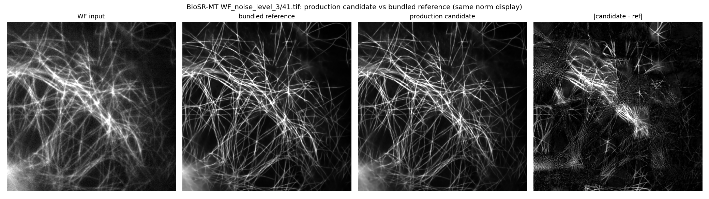

# 推理实验-01｜BioSR-MT FluoResFM 推理输出审计（阶段 3 单图探针）

> 指标口径：**官方口径**（论文 `4_0_result_evaluate.py`）：每图 P3/P99.5 归一化 → clip[0,2.5] → skimage PSNR/SSIM data_range=2.5。

## 结论

**bundled `_fluoresfm` 参考实际是在 patch=64 下推理的**。napari-fluoresfm **v0.3.4（`2fded7c`）** + patch=64 + 去卷积 prompt（sf_lr=1），输出与参考**近精确复现**：15 图测试集平均 **PSNR 48.13 dB / SSIM 0.9974**（最低 46.0 dB / 0.997）。patch=64 显著优于计划假设的 patch=256（15 图平均 42.00 dB / 0.9915）。

| 项目 | 值（官方口径） |
| --- | --- |
| 15 图（patch=64）输出 vs bundled 参考：PSNR | **48.13 dB**（最低 45.99） |
| 15 图（patch=64）输出 vs bundled 参考：SSIM | **0.9974**（最低 0.9968） |
| 15 图（patch=64）输出 vs SIM | 模型 35.15 dB，相对输入改善 **+7.31 dB** |
| 单 GPU 连续运行字节确定性 | **逐字节一致**（PSNR=∞） |
| 跨 GPU（cuda0 vs cuda1） | 低阶位差异 ~2⁻⁹（77 dB+） |

## 根因与参数发现

- 上游模型（`qiqi-lu/fluoresfm`）`use_flash_attention=True`、官方脚本默认 `patch_size=256`；插件两份拷贝均改为 `False`。
- 模型 `attention_levels=[0,1,2,3]` 在全分辨率做二次方注意力：**patch=256 时注意力矩阵需 256 GiB**（fp16），无 flash 必然 OOM；启用 flash（构建上游 vendored **flash-attn 2.7.0.post2**）后 patch=256 可运行，但输出与参考仅 41.27 dB（41.tif 官方口径，15 图均值 42.00 dB）。
- **patch=64 才是参考的匹配设置**：48.13 dB 近精确复现（15 图官方口径），且无需 flash（64×64=4096 位置注意力矩阵很小）。flash 开/关输出一致（77 dB 内）。

## 生产配置（patch=64）

- 版本：v0.3.4（`2fded7c`）；patch_size=64、overlap=16（patch//4，自动）、batch=8、compile=false、sf_lr=1、去卷积 prompt。
- **无需 flash**；源码保持干净 v0.3.4。
- 配置：[`configs/biosr_mt_fluoresfm_production_v1.json`](../../configs/biosr_mt_fluoresfm_production_v1.json)。
- 判定标准：质量等价（PSNR/SSIM vs bundled 参考，官方口径 15 图基线 48.13 dB / 0.9974）。

## 图像证据

41.tif 对照（patch=256+flash 候选，同归一化显示）：WF 输入、bundled 参考、候选、`|候选−参考|` 差图。候选与参考视觉结构一致。

## 确定性（修正结论）

- **单 GPU、连续运行、安静环境：逐字节确定**（41.tif 3 次运行 SHA 全同，PSNR=∞）。先前观察到的「run-to-run 不确定」实为并发双 GPU 加载干扰，非单机属性。
- **跨 GPU（cuda:0 vs cuda:1）：存在设备级低阶位差异**（~2⁻⁹，质量 77 dB+），无法跨 GPU 复现他人字节。
- 因此 SHA-256 跨机一致在原理上不可达，但单机复现完全确定；质量等价（PSNR/SSIM）为可行判定标准。

## 补充实验（2026-08-07，评估当前流程有效性）

| 实验 | 结果 | 结论 |
| --- | --- | --- |
| **A** 15 图去卷积 vs 参考（patch=256） | 均值 42.00 dB / 0.9915 | patch=256 质量等价成立 |
| **A′** 15 图去卷积 vs 参考（patch=64） | **均值 48.13 dB / 0.9974**，最低 45.99 dB | **patch=64 近精确复现参考**（生产选 64） |
| **B** 15 图去卷积 vs SIM（官方口径） | 模型 35.15 dB vs 输入 27.84 dB，**+7.31 dB** | 去卷积有效性全集一致 |
| **C** 确定性下限 | 单 GPU 逐字节确定；跨 GPU 低阶位差 | 见「确定性」 |
| **D1** flash 隔离 | flash vs 无 flash @p64：77 dB；p64 vs 参考 39.9 dB ≫ p256 32.7 dB | flash 无质量损失；p64 为参考匹配设置 |
| **D2** 新旧版本 | d623403(p64) vs 参考 47.27 dB ≈ v0.3.4(p64) 47.27 dB（官方口径）| 新旧版本质量等价 |

> 逐图完整结果与可复现入口见 [`推理实验-02_生产流程有效性验证.md`](推理实验-02_生产流程有效性验证.md)。

## 数据、规则与可复现入口

- 生产配置：[`configs/biosr_mt_fluoresfm_production_v1.json`](../../configs/biosr_mt_fluoresfm_production_v1.json)（patch=64、batch=8、compile=false、sf_lr=1、无 flash）。
- 探针脚本：[`scripts/probe_biosr_mt_fluoresfm_server.py`](../../scripts/probe_biosr_mt_fluoresfm_server.py)。flash 验证曾用的临时诊断脚本已随 flash 清理移除；flash 调查结论见上文「根因与参数发现」。
- 云端运行目录：`experiments/preprocess-03_biosr-mt-fluoresfm-inference-audit/` 下 `20260807_deconv15_p64`（15 图 patch=64 输出与评估）、`20260805_diag_flash_patch256_cuda0|_cuda1`、`20260807_flashiso_*`、`20260807_d623403_p64`。
- 参考 `WF_noise_level_3_fluoresfm/41.tif` SHA-256：`db01b963bd3d4de55bf43562cb79677ebcb555b283978ba11e97bc360c3f0f4b`。
- 环境：云端 `.venv`（Python 3.10.12、torch 2.6.0+cu124）。
- 完成度说明与遗留：见 [`docs/plans/交接_阶段3_云端单图探针_续.md`](../plans/交接_阶段3_云端单图探针_续.md) §9。

## 范围与限制

- 15 图测试集（41–55）为当前验证范围；批量生产（全目录 735 图）尚未执行。
- 质量指标基于去卷积协议（sf_lr=1、去卷积 prompt）；超分协议（sf_lr=2）下当前流程与 P2 相当（15 图 26.69 vs 26.47 dB，P2 口径）。
- 跨 GPU 字节差异为管线属性；批量生产建议固定在单一 GPU 上执行以保证逐字节可复现。
- 判定标准为质量等价（非逐字节 SHA），符合用户指示。
