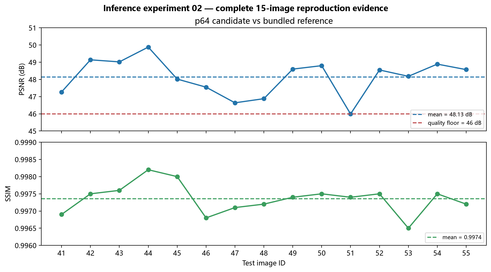

# 推理实验-02｜规范生产流程验证

> 状态：已完成（2026-08-07；2026-08-08 完成口径校正）。
> 日期：2026-08-07。
> 目的：在 15 图测试集上验证冻结生产流程的参考复现质量、真值保真度与变量隔离。
> 范围：BioSR-MT level-3 的 41–55，去卷积协议（sf_lr=1）；官方协议对齐、SIM 重算与确定性归因见推理实验-03。
> 指标口径：官方口径——每图 P3/P99.5 归一化 → clip[0,2.5] → PSNR/SSIM `data_range=2.5`。

## 结论

**生产流程（napari-fluoresfm v0.3.4 + patch=64 + 去卷积 prompt + sf_lr=1）在 15 图测试集上近精确复现 bundled 参考，并对 SIM 真值有稳定的大幅改善。**

| 验证维度 | 结果（官方口径） |
| --- | --- |
| 15 图输出 vs bundled 参考 | **PSNR 48.13 dB / SSIM 0.9974**（最低 46.0 dB / 0.997） |
| 15 图输出 vs SIM | **34.76 dB**；相对 WF 输入（27.56 dB）**改善 +7.20 dB**（官方 avg-pool 复核） |
| 确定性 | 质量等价判定不使用 SHA；跨进程确定性与可选确定性变体见推理实验-03 |
| flash 开/关 | 输出一致（77 dB），flash 无质量影响 |
| 新旧版本（d623403 vs v0.3.4） | 输出一致（77 dB），质量等价 |

## 关键证据

### A. 15 图去卷积 vs bundled 参考（patch=64）

每张去卷积输出 vs 各自 bundled `_fluoresfm` 参考（官方口径：每图 P3/P99.5 → clip[0,2.5] → data_range=2.5）：

| 图 | PSNR | SSIM | | 图 | PSNR | SSIM |
| --- | --- | --- | --- | --- | --- | --- |
| 41 | 47.27 | 0.9969 | | 49 | 48.60 | 0.9974 |
| 42 | 49.14 | 0.9975 | | 50 | 48.80 | 0.9975 |
| 43 | 49.02 | 0.9976 | | 51 | 45.99 | 0.9974 |
| 44 | 49.88 | 0.9982 | | 52 | 48.55 | 0.9975 |
| 45 | 48.02 | 0.9980 | | 53 | 48.18 | 0.9965 |
| 46 | 47.55 | 0.9968 | | 54 | 48.89 | 0.9975 |
| 47 | 46.64 | 0.9971 | | 55 | 48.57 | 0.9972 |
| 48 | 46.88 | 0.9972 | | | | |

- 平均 **48.13 dB / 0.9974**（官方口径）；最低 **45.99 dB / 0.9968**。全部 ≥45.99 dB / ≥0.9965，近精确复现；45.99 dB 按一位小数显示为 46.0 dB。
- 对照：patch=256 下 15 图平均 42.00 dB / 0.9915（官方口径）→ **patch=64 为参考匹配设置，提升 6.1 dB**。

该参数选择由推理实验-01 的探针完成；此处保留它仅作为本规范验证的固定前提，不将其计为第二次独立复现。

下图给出 41–55 的完整逐图证据，而非仅报告均值。虚线为均值与预设质量下限；数值直接转录自上表，绘图入口为 `scripts/plot_biosr_mt_inference_evidence.py`。

### 真实 p64 图像对照（level-3）

下图直接使用远端（个人云端）确定性生产批次 `20260808_batch_production_det_v1` 的最终 TIFF。41、44、47 分别覆盖本表的典型（47.27 dB）、较高（49.87 dB）和较低（46.64 dB）复现分数；候选 SHA-256 已在同步后与远端一致。WF、候选与参考分别按 P3/P99.5 归一化后在相同显示范围下呈现；残差按各样本 P99.9 放大，仅用于定位差异。

生成入口为 `scripts/plot_biosr_mt_inference_evidence.py`；候选来源和完整 SHA-256 见 `data/derived/biosr-mt-final-acceptance/20260808/visual_evidence/p64_deterministic_level3/README.md`。

### B. 15 图去卷积 vs SIM（官方口径）

每图 P3/P99.5 归一化 → clip[0,2.5] → data_range=2.5；SIM 以官方 `avg_pool2d(kernel=2)` 降采样到 502 对齐输出分辨率：

- 模型输出平均：**PSNR 34.76 dB / SSIM 0.9351**
- bundled 参考：34.58 dB / 0.9325；WF 输入基线：27.56 dB
- **改善：PSNR +7.20 dB**，候选较参考 +0.18 dB。

去卷积有效性在全集上成立（输出显著更接近 SIM 真值，远高于输入）。

### C. 变量隔离

跨进程数值变动的机制与可选确定性变体由推理实验-03 的专门诊断给出；本实验只确认这些变量不改变质量等价结论。

> 以下均为 41.tif 单图、官方口径。此前 `39.9 / 32.7 dB` 的 data_range=1.0 旧口径已由 `47.27 / 41.27 dB` 取代。

| 对比 | PSNR | 结论 |
| --- | --- | --- |
| patch=64 flash vs 无 flash | 77.3 dB | flash 不改变输出 |
| patch=64 vs patch=256（vs 参考） | 47.27 vs 41.27 dB | **patch=64 近精确复现；patch=256 仅质量等价** |
| d623403(p64) vs v0.3.4(p64) | 77.3 dB | 新旧版本质量等价 |
| d623403(p64) vs 参考（官方口径）| 47.27 dB | 老版本同样近精确复现 |

## 方法与可复现性

### 配置与评价规则

- 生产配置：[`configs/biosr_mt_fluoresfm_production_v1.json`](../../configs/biosr_mt_fluoresfm_production_v1.json)（patch=64、batch=8、compile=false、sf_lr=1、无 flash）。
- 评估口径：官方口径——独立 P3/P99.5 → clip[0,2.5] → PSNR/SSIM `data_range=2.5`（论文 `4_0_result_evaluate.py`）。

## 数据与入口

- 云端运行目录：`experiments/preprocess-03_biosr-mt-fluoresfm-inference-audit/` 下 `20260807_deconv15_p64`（实验 A）、`20260807_deconv15`（patch=256 对照）、`20260807_det_run1..3`/`20260807_det_cuda1`（实验 C）、`20260807_flashiso_*`（实验 D1）、`20260807_d623403_p64`（实验 D2）。
- 环境：云端 `.venv`（Python 3.10.12、torch 2.6.0+cu124）。

## 限制与边界

- 验证范围为 15 图测试集（41–55），去卷积协议（sf_lr=1）；后续 90 全图与 735 patch 批量生产见推理实验-03，文件级验收见推理实验-04。
- 超分协议（sf_lr=2）下当前流程与 P2 相当（26.69 vs 26.47 dB），不在本实验逐图重复。
- 字节差异为管线属性：同进程内逐字节确定、跨进程/跨 GPU 有低阶位差；**跨进程逐字节复现不可依赖**。
