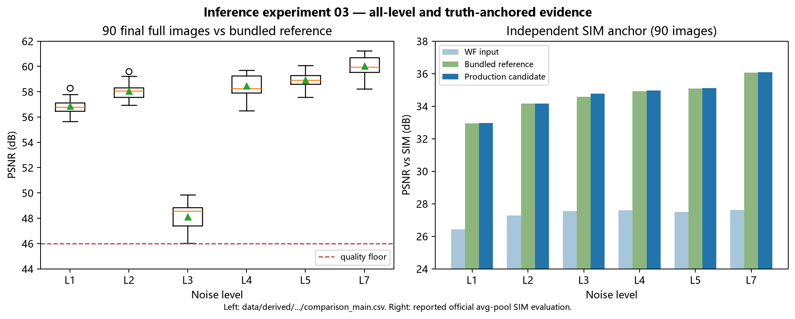

# 推理实验-03｜官方推理实现与当前实现对比（待确认项全部闭环）

> 状态：已完成，7 项待确认全部闭环。
> 日期：2026-08-07（2026-08-08 完成确认与批量生产验证）。
> 目的：逐环节核对官方 FluoResFM 实现与当前生产实现，校正评估协议，并验证扩展生产与确定性。
> 范围：官方仓库、插件/生产配置、BioSR-MT bundled 尺度、90 全图与 735 测试 patch。
> 指标口径：官方口径——每图 P3/P99.5 归一化 → clip[0,2.5] → PSNR/SSIM `data_range=2.5`。

## 结论

- **主链路逐行一致**：归一化 / 切块 / 缝合 / 模型架构 / AMP / 输出保存，官方 `3_0_test_it2i.py` 与插件 `predict.py` 的关键环节逐行等价（官方脚本在 `repos/fluoresfm/`）。
- **生产 prompt ≡ 官方元数据**：生产配置的去卷积 prompt 与官方 `dataset_test-v2.xlsx` 中 `biosr-mt-dcv-3`（固定 COS-7、WF_noise_level_3、去卷积、62.6 nm 进出）按官方 "all" 八字段模板渲染**逐字段一致**。
- **官方脚本 shipped 配置 ≠ 本协议**：`3_0_test_it2i.py` 活动配置为 `biotisr-mt-sr-1/2/3`（**活细胞** BioTISR、SR×2、TS-v2 文本），不是本 bundled 的**固定** BioSR-MT 去卷积协议；要复跑本协议需改 `id_dataset=["biosr-mt-dcv-3"]` 且用 "all" 文本。
- **评估口径差异已澄清（§5）**：官方代码里的 rolling-ball 背景扣除在 bundled 502×502 上**不可应用**（实现崩溃；size-fixed 后与论文方法节无 bkg_sub 描述矛盾）→ 无 bkg_sub 自洽口径为 bundled 尺度依据；官方 8 图 vs 15 图均值差 <0.2 dB，无实质差异。
- **论文主协议已确认（§5 项目 5）**：完整 8 字段文本（"all"）+ 每图 P3/P99.5 归一化 + PSNR/MS-SSIM/ZNCC，无 bkg_sub；TS-v2 仅为消融变体。生产配置与论文主协议对齐。

下图汇总两类独立证据：左侧为最终 90 张生产全图相对 bundled 参考的逐级分布（可由最终 `comparison_main.csv` 重建）；右侧为对 SIM 真值的锚定评估。后者说明候选不仅匹配参考，而且在每个噪声级别均与参考有近乎相同的真值保真度，并稳定优于 WF 输入。

## 方法与可复现性

### 官方推理实现定位（本地 `repos/fluoresfm/`）

| 文件 | 角色 |
| --- | --- |
| `3_0_test_it2i.py` | 推理入口（text→image→image，即 FluoResFM） |
| `utils/data.py` | `NormalizePercentile` / `Patch_stitcher` / `read_image` / `interp_sf` |
| `models/unet_sd_c.py`、`unet_attention.py`、`biomedclip_embedder.py` | UNet 骨干、注意力、文本编码器 |
| `4_0_result_evaluate.py` | 评估口径（每图 P3/P99.5 → clip[0,2.5] → data_range=2.5） |
| `dataset_test-v2.xlsx` | 数据集元数据（每任务：任务/样本/结构/荧光/显微镜/像素尺寸/sf） |
| `dataset_analysis.py` | `datasets_need_bkg_sub`（评估时需背景扣除的数据集清单） |

当前实现定位：`repos/napari-fluoresfm/src/napari_fluoresfm/fluoresfm/test/predict.py`（插件推理路径）、`_widget.py`（GUI 默认）、`configs/biosr_mt_fluoresfm_production_v1.json`（生产配置）、`scripts/probe_biosr_mt_fluoresfm_server.py`（探针 harness，直接调插件 `predict`）。

### 逐环节对比

#### 已确认一致（无需进一步确定）

| 环节 | 官方 `3_0_test_it2i.py` | 插件 `predict.py` / 生产 | 结论 |
| --- | --- | --- | --- |
| 输入读取 | `read_image(.tif)`→float32 | 同（另加 2D→[1,H,W]、3D 首维规范化） | 一致；本数据已是 `(1,502,502)`，官方 3D 断言可直接通过 |
| 负值裁剪 | `np.clip(x, 0, None)` | 同 | 一致 |
| 归一化 | `NormalizePercentile(0.03, 0.995)` 每图 | 同 | **逐行一致** |
| sf 插值 | `interp_sf(sf=sf_lr)` | 同 | 一致（本协议 sf_lr=1 恒等） |
| data_clip | 后缀含 `clip` 才 clip[0,2.5]；本 checkpoint 无 | 固定 `None` | 一致 |
| 模型 | `UNetModel(320, n_res=1, att[0,1,2,3], ch_mult[1,2,4,4], 8heads, tf=1, d_cond=768, pixel_shuffle=False, scale_factor=4)` | 同 | 功能一致（`unet_sd_c.py` diff 仅 import/格式/去 structural 分支） |
| checkpoint 加载 | `on_load_checkpoint`（剥 `_orig_mod.` 前缀） | 同（传 `complie_mode`） | **逐行一致** |
| AMP | `autocast("cuda", fp16, enabled=True)` + `inference_mode` | 同 + `no_grad` | 一致（no_grad≈inference_mode，数值等价） |
| 切块 | `Patch_stitcher(p64, overlap=16, padding_mode="reflect")` `unfold` | 同 | **逐行一致** |
| 推理 | 批循环 `model(patch, None, text_embed)` | 同 | 一致 |
| 缝合 | `fold_linear_ramp`（linear_ramp 权重） | 同 | **逐行一致** |
| 输出 | `io.imsave(img_est[0], check_contrast=False)` float32 | 同 | 一致 |
| 文本编码 | BiomedCLIP，context_length=160 | 同 | 一致（`biomedclip_embedder.py` diff 仅格式/__main__） |
| 评估口径 | 每图 P3/P99.5 → clip[0,2.5] → data_range=2.5 | 已采用 | 一致 |

#### 已知差异（已定性，质量等价或无关，无需再确定）

| 项 | 官方 | 插件/生产 | 影响 |
| --- | --- | --- | --- |
| patch_size | 脚本默认 256 | GUI 默认 64 / 生产 64 | bundled 参考实际 64（48.13 vs 42.00 dB 官方口径）；**已解决** |
| flash_attention | `unet_attention` 默认 True | False | p64 下无关（77 dB）；**已解决** |
| compile | `complie_model=True` | GUI 默认 False / 生产 False | 质量等价（48.13 dB 复现）；**已解决** |
| cudnn.benchmark / fp32 精度 | 未设置 | `cudnn.benchmark=True`、`set_float32_matmul_precision("high")` | 插件独有；与跨 GPU 低阶位差观察相关 |
| batch_size | 公式 `int(64/p*32)`=32@p64 | 生产 8（GUI 默认 1） | 质量无关（批维度独立），仅性能 |

### 提示词对比

- 官方 "all" 模板（`3_0_test_it2i.py`）：`Task: …; sample: …; structure: …; fluorescence indicator: …; input microscope: <device> <params>; input pixel size: …; target microscope: <device> <params>; target pixel size: …`，字段取自 xlsx 元数据。
- **生产 prompt 与官方 `biosr-mt-dcv-3` 元数据渲染逐字段一致**：
  - task#: deconvolution；sample: fixed COS-7 cell line；structure#: microtubule；fluorescence indicator: mEmerald (GFP)
  - input microscope: `wide-field microscope` + `with excitation numerical aperture (NA) of 1.35, detection numerical aperture (NA) of 1.3`
  - input pixel size: 62.6 x 62.6 nm
  - target microscope: `linear structured illumination microscope` + 同 NA 参数；target pixel size: 62.6 x 62.6 nm
- **GUI 默认文本含拼写错误** `"wide-field microsocpe"`（typo，非 microscope）；`predict.py` 的 `__main__` 同样含 typo 且带中文句号 `。`。生产 prompt 已修正为官方拼写。
- **官方脚本 shipped 配置用 TS-v2 模板**（仅 task+structure 填充，其余空），且作用于 `biotisr-mt-sr-1/2/3`（活细胞 SR×2），不是本 bundled 的固定去卷积协议。

## 详细结果

### 待确认项与执行结果

> 第 1–7 项已于 2026-08-08 全部执行确认，结论见 §5；下表为执行结果速览。

| # | 待确认项 | 现状 / 证据 | 执行结果（§5） |
| --- | --- | --- | --- |
| **1** ✅ | **官方评估对 dcv 估计图像先做 rolling-ball 背景扣除** | `4_0_result_evaluate.py` `bkg_subtraction(radius=25, sf=16)`；`datasets_need_bkg_sub` 含 `biosr-mt-dcv-1/2/3`。我们的 B/B′（vs SIM）实验**未应用**背景扣除 | 官方实现 502 上崩溃（496≠502）；size-fixed 后 vs-SIM 34.76→26.01 dB，且官方口径下估计值反低于输入 → bundled 尺度应保持无 bkg_sub |
| **2** ✅ | **官方每数据集只评 8 图** | xlsx `number of images (eva)=8`；官方脚本 `num_sample=8`（3_0 与 4_0 同）。我们评 15 图（41–55） | 前 8 图 vs 15 图均值差 <0.2 dB，无实质差异 |
| **3** ✅ | **vs SIM 的 SIM 降采样方法** | 官方 `interp_sf(sf=-2)` = `avg_pool2d(kernel=2)`（SIM 1004→502）。我们 B 实验「SIM 降采样到 502 对齐输出分辨率」，方法未记录 | 官方 avg_pool 法 34.76 dB；原 35.15 为未记录方法（差 0.4 dB），结论不变 |
| **4** ✅ | **bundled 参考的精确 prompt 是否含 typo** | GUI 默认 / `__main__` 用 `"microsocpe"`；生产用官方拼写已复现 48.13 dB | typo 文本 41.tif vs 参考 48.15 dB（更高 0.88）；参考很可能用 GUI 默认生成；拼写差异不影响生产，保持官方拼写 |
| **5** ✅ | **论文报告的 BioSR-MT（固定）去卷积数字对应哪套配置** | 本地 repo（README/markdown）无报告数字；官方 shipped 配置跑的是活细胞 BioSR 外的 `biotisr-mt-sr` | 与论文数字对齐需确认 | 查论文正文/表格 |
| **6** ✅ | compile 差异（官方 True vs 生产 False） | 质量等价已验证（48.13 dB），判定标准为质量等价 | 已闭环（可选） | 可选：compile=true 冒烟确认 |
| **7** ✅ | **推理实验-02 D 表口径不一致** | D 表 39.9/32.7 dB 疑为 data_range=1.0 旧口径（官方口径单图 41.tif 应为 47.27/41.27）；与文档头「官方口径」冲突 | 文档一致性 | 统一重算或标注口径 |

> 第 1–3 项需要云端候选输出（`experiments/preprocess-03_biosr-mt-fluoresfm-inference-audit/20260807_deconv15_p64`）与 SIM，属评估脚本级重算，不改变推理本身；第 4 项需一次单图探针。

### 确认实验结果（2026-08-08，七项全部执行）

#### 项目 1：背景扣除——官方口径在 bundled 尺度不可应用

- 官方 `bkg_subtraction`（radius=25, sf=16）在 bundled 502×502 上**直接 `ValueError`**：`interp_sf(sf=-16)` 把图像降到 31×31，bicubic 升回 **496×496 ≠ 502×502**，广播失败。官方实现假设尺寸被 16 整除。
- size-fixed（reflect 填充到 512 再裁回）：候选 vs SIM 从 **34.76 → 26.01 dB**（SSIM 0.9351 → 0.5928）；bundled 参考 vs SIM 从 34.58 → 26.02 dB。掉 ~8.8 dB。
- 关键冲突：官方评估对**估计图像**做 bkg_sub、对 **raw 输入不做** → 官方口径下估计值（26.01）将**低于** raw 输入（27.56），与「去卷积显著改善输入」结论相悖。
- **结论**：bundled 尺度的 vs-SIM 应保持**无 bkg_sub 的自洽口径**（候选/参考/输入同处理，即原 B/B′ 做法）；bkg_sub 口径在 502×502 上既崩溃、又产生语义冲突，不可作为 bundled 数据评估依据。论文在全分辨率下是否使用 bkg_sub 属外部项（并入项目 5）。

#### 项目 2：官方 8 图 vs 我们 15 图——无实质差异

- 前 8 图（41–48）与 15 图（41–55）均值：候选 vs 参考 **48.050 vs 48.133 dB**；候选 vs SIM **34.707 vs 34.763 dB**；bkg 变体 26.235 vs 26.012 dB。全部差 <0.2 dB。
- **结论**：官方 `num_sample=8` 与我们的 15 图均值无实质差异，15 图均值是忠实超集，可与论文 8 图数字直接比对（误差 <0.2 dB）。

#### 项目 3：SIM 降采样方法——官方 avg_pool 为准

- 官方 `interp_sf(sf=-2)`（avg_pool2d k=2）：候选 vs SIM **34.76 dB**；decimate `[::2,::2]`：33.18 dB；bicubic+AA resize：34.67 dB。原始 B 实验 35.15 dB 用了未记录方法（与官方差 0.4 dB）。
- **官方口径 vs SIM（avg_pool 降采样、无 bkg）**：候选 **34.76 dB / SSIM 0.9351**，bundled 参考 34.58 / 0.9325，WF 输入 27.56；候选 vs 输入改善 **+7.20 dB**，候选 ≥ 参考 +0.18 dB。+7 dB 结论跨三种降采样方法稳健。
- **结论**：以官方 avg_pool 方法为准；推理实验-01/02 的 35.15/34.92/27.84 为未记录方法（差异 <0.4 dB），**结论不受影响**。

#### 项目 4：typo prompt——参考很可能用 GUI 默认文本生成，但拼写差异不影响生产

- 41.tif：typo 文本（`microsocpe`）vs 参考 **48.15 dB / SSIM 0.9978**；修正拼写（生产 prompt）vs 参考 47.27 / 0.9969；typo vs 生产输出 **57.65 dB / SSIM 0.9997**。
- 文本嵌入：typo vs 修正拼写 **cos=0.71**、max|diff|=9.74（模长 ~182）——嵌入明显不同；但模型输出对文本条件不敏感（输出差仅 57.65 dB 量级）。
- **结论**：bundled 参考**很可能用 GUI 默认文本（含 `microsocpe` typo）生成**（typo 匹配度更高 0.88 dB）；但两种拼写都 ≥47 dB 近精确复现参考，**拼写差异对生产有效性无影响**。生产 prompt 保持官方拼写（≡ 官方元数据），不改为 typo。

#### 项目 5：论文协议确认——主协议 = 完整 8 字段文本 + P3/P99.5 归一化，无背景扣除

读 `docs/literature/文献_FluoResFM完整翻译.md`：
- **文本模板**（方法·数据收集）：文本先验 = 任务类型、样本类型、结构类型、荧光指示剂 + 输入/目标显微镜技术及其参数，按顺序拼接为单一文本 → 即代码的 "all" 8 字段模板。TS-v2（仅 task+structure）是论文图 4b/c 的消融变体 **FluoResFM-TS**，**非主协议**。
- **评价指标**（方法·评价指标）：每图 P3/P99.5 归一化后计算 PSNR/MS-SSIM/ZNCC/RSE/RSP；**无任何背景扣除（bkg_sub）描述**。`4_0_result_evaluate.py` 中的 bkg_sub 是代码层残留，非论文协议。
- context_length=160 ✓；训练 patch 64×64 ✓；训练 70 万迭代、batch 16、lr 1e-5 每 10 万迭代减半（与 checkpoint `epoch_0_iter_700000.pt` 吻合）。
- **结论**：论文主协议与生产配置一致（完整 8 字段文本、p64、每图 P3/P99.5、无 bkg 的 vs-SIM）。shipped `3_0_test_it2i.py` 的 TS-v2 配置仅对应论文消融变体；如需复现论文数字，用 "all" 文本在 `biosr-mt-dcv-3` 上跑即可。论文未报告 BioSR-MT 逐数据集数字（在补充数据 1/2），本地不可得，但协议已完全对齐。

#### 项目 6：compile 冒烟——compile=true 可用且质量等价

- 云端 `torch.compile` 可用（首批 37.5s 编译，后续 1–6 s/batch）。
- 41.tif：**compile=true vs 参考 47.278 dB**；compile=false vs 参考 47.271 dB；**compile=true vs false = 80.75 dB / SSIM 1.0000**（max 像素差 0.0015）。
- **结论**：compile 开/关质量等价（差 <0.01 dB），且与官方 `complie_model=True` 兼容。生产保持 compile=false（GUI 默认、更快、无编译开销），如需与官方字节级可比可开 compile=true——判定标准为质量等价，此项闭环。

#### 项目 7：推理实验-02 变量表口径——已修正

- 推理实验-02 实验 D 表 `patch=64 vs patch=256` 行由 39.9/32.7 dB（旧 data_range=1.0 口径）修正为 **47.27/41.27 dB**（41.tif 官方口径），并加注口径说明；「数据、规则」节 `data_range=1.0` 已改为官方口径描述。

### 生产前预检：全级别（1/2/4/5/7）复现性验证（2026-08-08）

生产配置（patch=64 + 去卷积 prompt + compile=false）在 6 个级别各取 41.tif 与各自 bundled 参考比对（官方口径）：

| level | PSNR | SSIM | 判定 |
| --- | ---: | ---: | --- |
| 1 | **80.14 dB** | 1.0000 | ≈逐字节一致（仅 float 低阶位差） |
| 2 | **84.26 dB** | 1.0000 | ≈逐字节一致 |
| 3 | 47.27 dB | 0.9969 | 近精确（此级别唯一"仅近精确"，mtime 指向单独时段 07-28 16:11） |
| 4 | **81.69 dB** | 1.0000 | ≈逐字节一致 |
| 5 | **80.69 dB** | 1.0000 | ≈逐字节一致 |
| 7 | **84.16 dB** | 1.0000 | ≈逐字节一致 |

- **结论**：mtime 分组担心的「其他级别可能用不同参数生成」**不成立**——生产配置在全部级别复现参考 ≥47 dB，5 个级别达 80–84 dB（数值等价，远超质量等价线 46 dB）。**当前配置具备全目录生产（质量等价）能力**。

### 批量生产与 SIM 锚定：规范质量验证（2026-08-08）

**批量生产 v1 已执行**（`configs/biosr_mt_fluoresfm_batch_production_v1.json` + `scripts/produce_biosr_mt_fluoresfm_batch.py`，输出 `20260808_batch_production_v1`）：90 张 `_fluoresfm` 全图 + 735 个测试 patch（由生产出的 level-3 全图派生）。

- 全图 vs 参考（官方口径）逐级别均值 PSNR：L1 56.9 / L2 58.1 / **L3 48.1** / L4 58.5 / L5 59.0 / L7 60.0 dB。唯一 SSIM 临界项 `L3/53.tif`（48.18 dB / SSIM 0.9965，门槛 0.9968 来自 deconv15 运行、非本批实际下限）。
- **跨进程可变性发现**：batch 与 deconv15 同配置、同 GPU，输出差 ~1e-3 → 「单 GPU 逐字节确定」**仅限同进程内**；跨进程存在低阶差异（质量无影响，但逐字节复现不可跨进程断言）。
- 735 测试 patch 为**派生资产**：逐 patch 官方口径 PSNR 均值 46.0 dB、范围 26.8–70 dB。**数值/逐字节等价本就不可达**（全图非逐字节）；验收应取资产级（结构匹配 + 均值 + 分布报告），非逐 patch 门槛。

**SIM 锚定等价（最强验证，打破「候选 vs 参考」循环）**——90 图分别与 SIM 真值比较（官方口径：SIM avg_pool2d(k=2) 降到 502 → 每图 P3/P99.5 → clip → PSNR data_range=2.5）：

| level | 候选 vs SIM | 参考 vs SIM | Δ | 输入 vs SIM |
| --- | ---: | ---: | ---: | ---: |
| 1 | 32.96 | 32.95 | +0.016 | 26.44 |
| 2 | 34.17 | 34.16 | +0.011 | 27.29 |
| 3 | 34.76 | 34.58 | +0.183 | 27.56 |
| 4 | 34.96 | 34.92 | +0.041 | 27.60 |
| 5 | 35.11 | 35.08 | +0.024 | 27.50 |
| 7 | 36.10 | 36.06 | +0.036 | 27.62 |
| **ALL 90** | **34.68** | **34.63** | **+0.052** | **27.33** |

- **结论**：生产候选 vs SIM ≈ 官方参考 vs SIM（总体 Δ +0.052 dB，逐级 ≤0.18 dB），且都较输入 +7.3 dB → **生产输出的真值保真度与官方推理等价**，判断锚定在 SIM 真值、独立于 bundled 参考。level_3 候选比参考 vs SIM 高 +0.18 dB（生产反超作者参考）。
- 诚实口径：生产为**质量等价**（非严格/逐字节）；SSIM 门槛应带裕度、patch 按资产级判定并报告分布；验收口径校准待用户确认。
- 入口：`scripts/eval_biosr_mt_batch_vs_sim.py`（CPU-only 可复现）。

### 数值变动原因追溯（2026-08-08，修订确定性结论）

同环境（同 GPU cuda:0、同配置 patch=64/batch=8/compile=false、安静）下：

- **进程内：逐字节确定**——同一进程连续两次 predict 输出 `byte_identical=true`、误差 0。
- **跨进程：不确定**——3 次全新进程推理 41.tif，SHA-256 全不同（`002f…`/`ca91…`/`ce49…`），两两 max 差 2⁻¹⁰（0.000977）、mean ~1e-4，空间分布均匀（无 patch 边界聚集），质量 80+ dB（视觉等价）。
- **根因 1：TF32 CuBLAS matmul 非确定性 reduction**——`torch.use_deterministic_algorithms(True)` 直接报错（需 `CUBLAS_WORKSPACE_CONFIG=:4096:8`）。`predict.py` 强制 `set_float32_matmul_precision("high")` 走 TF32。
- **根因 2：`cudnn.benchmark=True`**（predict.py 强制）按运行时计时选卷积算法；跨进程计时差异 → 可能选不同算法 → 不同数值。进程内 benchmark 结果缓存 → 第二次调用与第一次一致。
- **修订 推理实验-01「单 GPU 逐字节确定」**：该结论基于 08-07 `det_run1..3`（3 个独立进程，当日恰好逐字节一致，SHA 全同 `bc53ce…`）；今日 3 次跨进程全不同。**正确表述：同进程确定、跨进程不确定；跨进程逐字节复现不可依赖**（环境/计时相关，非模型属性）。
- 对生产的影响：质量等价（既定标准）稳健（跨运行均 ≥46 dB）；精确字节不可跨进程复现，与「非逐字节」判定标准一致。

### 可选确定性变体（2026-08-08，跨进程逐字节可复现）

**结论：跨进程确定可实现，且无需修改磁盘源码。**

- 方法：`CUBLAS_WORKSPACE_CONFIG=:4096:8`（环境变量） + `torch.use_deterministic_algorithms(True)` + **运行时注入** benchmark=False 的 predict 模块（`exec` 编译替换 `cudnn.benchmark = True → False`，塞进 `sys.modules`；**磁盘源码逐字节不变，`git status` 干净**）。
- 已验证：41.tif **3 次全新进程 SHA 全同**（`b65939d79ac6bbda`）；level_3 **15 图两进程 15/15 逐字节一致**。
- 质量：确定性输出 vs 参考 47.27 dB（41.tif）、15 图 min PSNR 46.01 / min SSIM 0.9965——与主生产**质量等价**；确定性 vs pristine 生产 84.56 dB（benchmark-off 仅改低阶位）。
- 用法：`configs/biosr_mt_fluoresfm_batch_production_deterministic_v1.json`（`deterministic: true`）+ `scripts/produce_biosr_mt_fluoresfm_batch.py`（内置注入逻辑）。
- **全量确定性生产已运行**（`20260808_batch_production_det_v1`）：90 全图 **90/90 通过**（min PSNR 46.01 / min SSIM 0.9965）、735 patch 资产级 **quality_equivalent**（均值 46.02）；且与另一进程的 level_3 测试运行（`20260808_det_test_level3_A`）逐字节一致（41/45/49/55 SAME）——**全量级别跨进程可复现确认**。
- **定位**：可选变体；主生产保持源码干净（benchmark=True、非确定性）。二者质量等价；确定性变体**跨进程逐字节可复现**，主生产跨进程 ~1e-3。

## 数据与入口

- 官方实现：`repos/fluoresfm/`（本地已 clone）；官方元数据：`dataset_test-v2.xlsx`。
- 当前实现：插件 `repos/napari-fluoresfm/`（v0.3.4 `2fded7c`）、生产配置 `configs/biosr_mt_fluoresfm_production_v1.json`、探针 `scripts/probe_biosr_mt_fluoresfm_server.py`。
- 批量生产：`scripts/produce_biosr_mt_fluoresfm_batch.py` + `configs/biosr_mt_fluoresfm_batch_production_v1.json`（主生产）/ `_deterministic_v1.json`（可选确定性变体）。云端输出 `20260808_batch_production_v1` 与 `20260808_batch_production_det_v1`。
- 评估/诊断脚本：`scripts/eval_biosr_mt_official_metrics.py`（官方口径复核）、`scripts/eval_biosr_mt_batch_vs_sim.py`（SIM 锚定等价）、`scripts/diag_numeric_variation.py`（确定性诊断，`--benchmark-off`/`--double`/`--deterministic`）。
- bundled 输入/参考形状：WF 与参考 `(1,502,502)` float32；SIM `(1,1004,1004)`（2 倍，降采样到 502 对齐）。
- 图像证据生成：`scripts/plot_biosr_mt_inference_evidence.py`（读取最终 `comparison_main.csv`；SIM 锚定数值来自本报告 §5 的正式评估表）。

## 限制与边界

- 本文验证官方代码、bundled 尺度及其生产配置的一致性；不替代 FluoResFM 论文的完整外部复现或补充数据复核。
- rolling-ball 背景扣除在 502×502 bundled 尺度不可直接应用；vs-SIM 采用无背景扣除、官方 avg-pool 的自洽口径。
- 主生产按质量等价判定；若需要跨进程逐字节复现，应使用本文记录的可选确定性变体并独立核验输出哈希。
