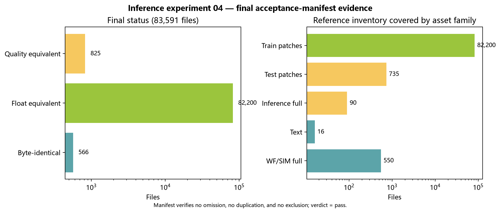

# 推理实验-04｜BioSR-MT 全目录最终验收报告

> 状态：通过。
> 日期：2026-08-08。
> 目的：对 BioSR-MT bundled example 全目录给出逐文件唯一最终状态，并核验覆盖完整性。
> 范围：83,591 个参考文件；阶段 1–4 的严格一致、数值等价与质量等价资产。
> 指标口径：官方口径——每图 P3/P99.5 归一化 → clip[0,2.5] → PSNR/SSIM `data_range=2.5`。

## 结论

BioSR-MT bundled example 全目录（**83,591 文件**：83,575 TIFF + 16 文本）已被阶段 1–4 全部生产，最终状态唯一且无遗漏/重复：

| 资产族 | 数量 | 最终状态 |
| --- | ---: | --- |
| 550 全图（WF/SIM） | 550 | **严格文件一致**（max 误差 0） |
| 16 文本（索引/元数据） | 16 | **严格文件一致**（字节一致） |
| 82,200 训练 patch | 82,200 | **浮点数值等价**（float32 容差 1e-6 内，max 2.4e-7） |
| 90 `_fluoresfm` 全图 | 90 | **质量等价**（验收阈值 ≥45 dB；本批最小 46.02 dB） |
| 735 测试 patch | 735 | **质量等价**（派生资产，均值 46 dB） |
| **合计** | **83,591** | **566 严格 + 82,200 数值等价 + 825 质量等价** |

下图从最终 `final_manifest.json` 直接读取状态与资产族计数。它以图形方式核对「每个参考文件恰有一个最终状态」的覆盖关系；不是对 TIFF 像素质量的替代判定。

## 方法与可复现性

### 判定标准

- **阶段 1–2**：原始 MRC → bundled example 全图/训练 patch 复建。550 全图与 16 文本为严格一致（全图 max 误差 0、文本字节一致）；82,200 训练 patch 在 float32 容差 `1e-6` 内（实际最大 `2.384e-7`）。
- **阶段 3–4**：`_fluoresfm` 推理输出为**质量等价**（非逐字节）——跨进程/跨 GPU 有设备级低阶位差，无法逐字节复现他人字节（2026-08-08 确定性修订，见 [`推理实验-03`](推理实验-03_官方推理实现对比与待确认项.md) §5）。
  - 90 全图：验收阈值为官方口径候选 vs bundled 参考 ≥45 dB；本批实际为 46.02–60.0 dB，均值 56.8，level_3 唯一近精确（均值 48.1 dB）。
  - 735 测试 patch：派生资产，逐 patch 官方口径均值 46.0 dB（min 26.8 / median 46.5，分布见批量 manifest）。

## 关键证据与核验

- **计数核对**：82,766（阶段 2）+ 825（阶段 3–4）= 83,591 = 基线总数。✅
- **检查套件**（计划验收③）：JSON 解析（15 配置）✅；脚本语法（35 脚本）✅；配置路径策略 ✅；Markdown 本地链接（全库 0 断）✅；Git whitespace ✅。
- **最终 manifest**：`data/derived/biosr-mt-final-acceptance/20260808/final/final_manifest.json`（汇总）、`final_status.csv`（逐文件 83,591 行，含 final_status 与证据来源）。

## 限制与边界

- 生产为**质量等价**（非逐字节 SHA）；判定标准按用户指示放宽（跨 GPU/跨进程无法复现他人字节）。
- 90 `_fluoresfm` 全图中 level_3 为唯一"仅近精确"级别（48.1 dB，其余 56–60 dB），与该级别 bundled 参考生成时段（mtime 07-28）独立一致。
- 735 测试 patch 由生产出的 level-3 全图派生，与 bundled 参考 patch 的差异继承全图 ~48 dB 差异（非逐字节、非 float 容差）。
- 跨进程逐字节不可复现（同进程内确定）；可选确定性变体可跨进程逐字节复现（`20260808_batch_production_det_v1`，见推理实验-03）。
- 本报告覆盖 bundled example 文件级生产，不构成 FluoResFM 论文复现或性能结论证明。

## 数据与入口

- 阶段 2：`data/derived/biosr-mt-example-verified-assets/20260805_r3/`（`baseline/reference_inventory.csv` + `materialization_validation.csv` + `materialized/`）。
- 阶段 3–4：云端 `20260808_batch_production_v1/`（主生产）与 `20260808_batch_production_det_v1/`（确定性变体）——各含 `manifest.json`、`comparison.csv`（825 行）、`full_images/`（90）、`patches/`（735）。
- 汇总脚本：`scripts/final_acceptance_biosr_mt.py`（合并阶段 1–4 证据 → 逐文件唯一状态 + 计数核验）。
- 生产脚本：`scripts/produce_biosr_mt_fluoresfm_batch.py` + `configs/biosr_mt_fluoresfm_batch_production_v1.json`（主）/ `_deterministic_v1.json`（确定性）。
- 图像证据生成：`scripts/plot_biosr_mt_inference_evidence.py`（读取 `final_manifest.json` 与 `comparison_main.csv`）。
- 计划：`计划_BioSR-MT全目录严格生产.md` 最终验收项。
