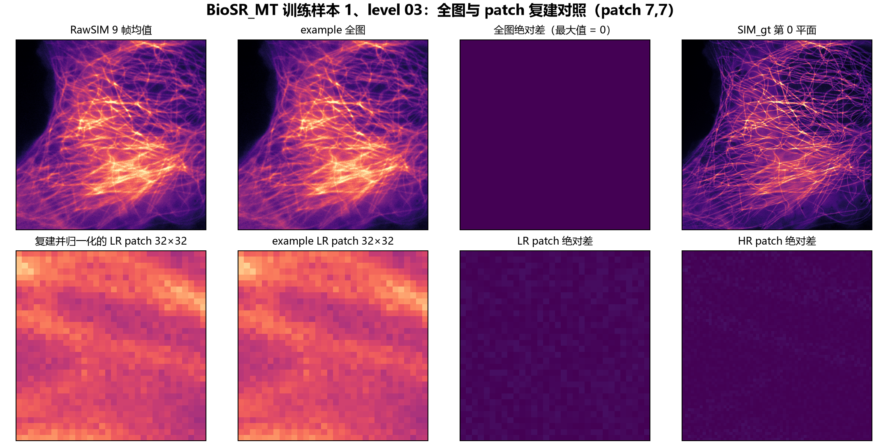

# 预处理实验-01｜BioSR-MT 原始 MRC 与 bundled example 一致性审计

## 结论

公开 BioSR `Microtubules.zip` 的原始 MRC 可以完整复建本地 BioSR-MT bundled example 的图像与训练补丁。

| 范围 | 比较数 | 最大绝对误差 |
| --- | ---: | ---: |
| 测试 WF：样本 41–55、level 1–9 | 135 张 | 0 |
| 测试 SIM：样本 41–55 | 15 张 | 0 |
| 训练 WF：样本 1–40、level 1–9 | 360 张 | 0 |
| 实际训练 patch：`train.txt` 的样本 1–30 | 147,960 个 LR/HR 数组 | `2.40090143321936e-07` |

patch 误差低于 `1e-6` 浮点 TIFF 写入容差，来自 float32 序列化；不构成图像变换差异。

## 图像证据一：测试样本的 9 帧聚合

测试样本 41 的 `RawSIMData_level_03.mrc` 包含 9 帧。沿第 3 轴取算术均值后，与 example 的 `WF_noise_level_3/41.tif` 逐像素完全相等；差图全为零。


适用于全部测试图的规则：

```text
RawSIMData_level_0n.mrc
→ 第 3 轴 9 帧算术均值
→ 不裁剪、不归一化、不旋转、不翻转、不转置
→ WF_noise_level_n/<图像编号>.tif
```

`SIM_gt.mrc` 的第 0 平面直接写出为 `SIM/<图像编号>.tif`。

## 图像证据二：训练全图与 patch

训练样本 1、level 03 的全图复建与 example 完全相等。下排展示位置 `(7,7)` 的 LR/HR patch 差图；色阶固定为 `0–1e-6`，使 float32 量级误差可见。



完整 patch 规则为：先将 WF 或 SIM 图像截断为非负值，各自按每图 P3/P99.5 归一化，再按固定、行优先滑窗切块。

| LR 网格 | 对应 HR 网格 | 索引条目 |
| --- | --- | ---: |
| `32×32`，步长 32 | `64×64`，步长 64 | 6,750 |
| `64×64`，步长 64 | `128×128`，步长 128 | 1,470 |

`train.txt` 只消费样本 1–30；31–40 虽存在于训练全图目录，但不在 bundled patch 索引中。

## 数据、规则与可复现入口

- 来源：[BioSR 数据集](https://figshare.com/articles/dataset/BioSR/13264793)（Figshare v9）；本地 `Microtubules.zip` 的 MD5 为 `df983755a1b45d512b000475e3072fc7`。
- 原始归档：`data/raw/BioSR/BioSR_MT/Microtubules.zip`。
- 测试全量审计：[配置](../../configs/biosr_mt_raw_equivalence_all_levels_20260805_r1.json)、[脚本](../../scripts/audit_biosr_mt_raw_equivalence_all_levels.py)、[结果](../../experiments/preprocess-01_biosr-mt-raw-equivalence/20260805_all_levels_r1/pixel_equivalence.csv)。
- 训练 patch 审计：[配置](../../configs/biosr_mt_train_patch_equivalence_20260805_r1.json)、[脚本](../../scripts/audit_biosr_mt_train_patch_equivalence.py)。
- 图像对照：[作图脚本](../../scripts/plot_biosr_mt_preprocessing_equivalence.py)。

## 范围与限制

- 这是 BioSR-MT bundled example 的内容级验证，不据此断言其他结构、数据集或论文全部训练流程使用同一规则。
- 相同输入只提供预处理可追溯性，不解决 RSP/DA 与传统保真指标之间的解释冲突。
- 若要比较不同预处理的效果，应在相同原始 MRC、目标、模型、文本和指标下预注册两个物理上合理的规则并配对评估。
