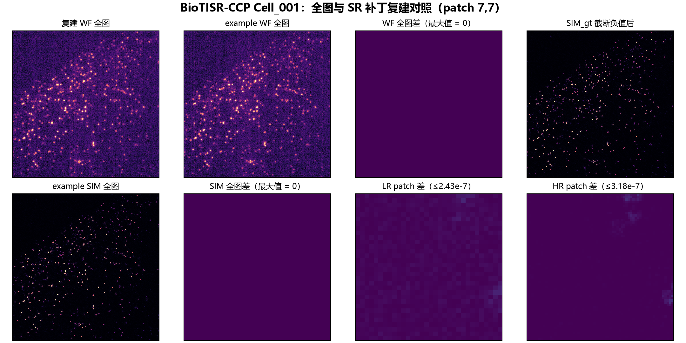

# 预处理实验-02｜BioTISR-CCP 原始 MRC 与 bundled example 一致性审计

## 结论

在 **bundled example 唯一提供的 `Cell_001`** 范围内，原始 MRC 经下述规则可以复现 example 的完整帧和实际 SR 微调补丁入口：

- `RawSIMData_level_01/02/03.mrc`：转换为时间轴后，每连续 9 帧逐像素算术平均，分别等于 `WF_noise_level_0/1/2`；每个水平的 20 张完整帧均为逐像素严格相等（最大绝对误差 `0`）。
- `SIM_gt.mrc`：转换为时间轴后将负值截断为 `0`，等于 `SIM` 的 20 张完整帧（最大绝对误差 `0`）。
- example 的 SR 微调入口为 `WF_noise_level_0_0_p32_s32_2d` → `SIM_0_p64_s64_2d`。对时间点 0 的输入、靶标分别做 P3/P99.5 标准化，再按行优先 16×16 网格裁出 32×32 与 64×64 补丁；256 个输入和 256 个靶标文件集合均完全对应。最大绝对误差分别为 `2.429513479285106e-07` 与 `3.1743493034142034e-07`，低于 `1e-6` 浮点 TIFF 序列化容差。

因此，在这个 example 覆盖范围内可称为“完全一致”：完整帧是严格相等，补丁是可由 float32 写入精度解释的数值一致。

## 图像证据一：原始 9 帧到 WF 输入

下图展示 `Cell_001`、时间点 0 的 `RawSIMData_level_01.mrc`。前 9 幅是连续原始帧；其算术均值与 example 的 `WF_noise_level_0` 完全相同，绝对差图全为零。


## 图像证据二：全图与 SR 补丁入口

下图将复建 WF/SIM 与 example 并排比较。WF 和 SIM 全图差均严格为零；时间点 0、位置 `(7,7)` 的 LR/HR 补丁差固定以 `0–1e-6` 色阶展示，最大值分别为 `2.43e-7` 和 `3.18e-7`。



## 可复现命令

```powershell
python scripts\audit_biotisr_ccp_example_train_equivalence.py `
  --config configs\biotisr_ccp_example_equivalence_20260805_r1.json
```

机器可读结果：[audit.json](../../experiments/preprocess-02_biotisr-ccp-example-equivalence/20260805_cell001_full_patch_r1/audit.json)。配置和脚本分别为 [JSON 配置](../../configs/biotisr_ccp_example_equivalence_20260805_r1.json) 与 [审计脚本](../../scripts/audit_biotisr_ccp_example_train_equivalence.py)。

图像对照可由 [作图脚本](../../scripts/plot_biotisr_ccp_preprocessing_equivalence.py) 重建。

## 已验证的精确规则

| 目标 example 路径 | 原始来源 | 处理 |
| --- | --- | --- |
| `WF_noise_level_0` | `RawSIMData_level_01.mrc` | 每 9 帧连续分组并求均值 |
| `WF_noise_level_1` | `RawSIMData_level_02.mrc` | 每 9 帧连续分组并求均值 |
| `WF_noise_level_2` | `RawSIMData_level_03.mrc` | 每 9 帧连续分组并求均值 |
| `SIM` | `SIM_gt.mrc` | 负值截断为 0 |
| `*_p32_s32_2d` / `*_p64_s64_2d` | 上述完整帧的时间点 0 | 各自 P3/P99.5 标准化，16×16 行优先无重叠裁块 |

## 范围与限制

- 这是对本地 **bundled example** 的内容级验证，不是对论文全部训练/测试划分的证明。
- example 只提供 `Cell_001` 的全帧与补丁，因而不能直接对其余原始 CCP 细胞宣称“与 example 一致”；只能将本规则外推，并应保留每个细胞的派生数据、配置及审计结果。
- 此结果确认了 `WF_noise_level_0/1/2` 的具体命名映射。它不自动解决其他实验表格中可能采用不同 `level` 编号的语义；使用时必须明确记录输入原始文件名。
